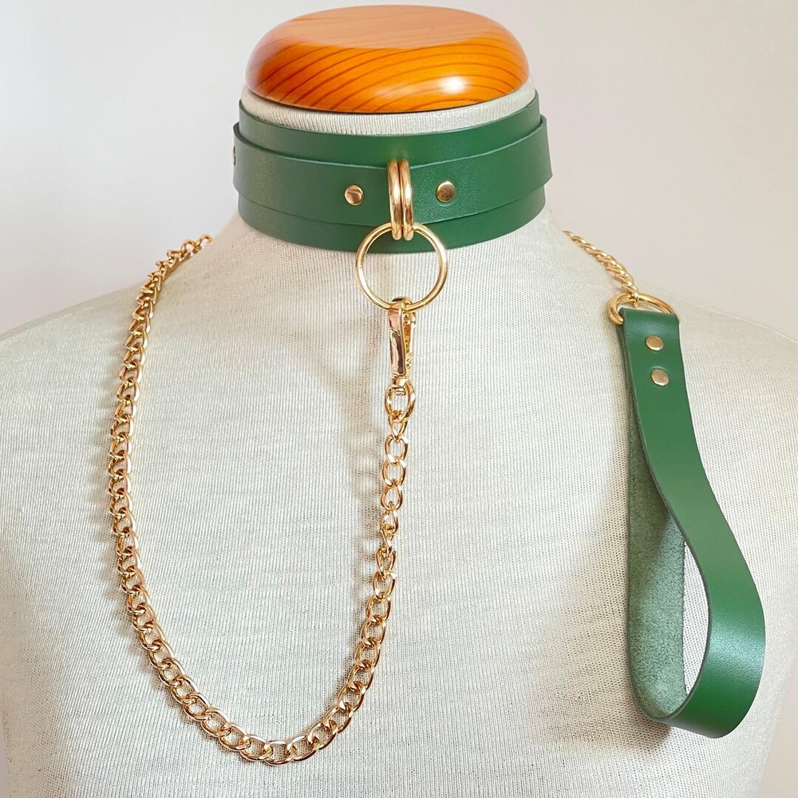
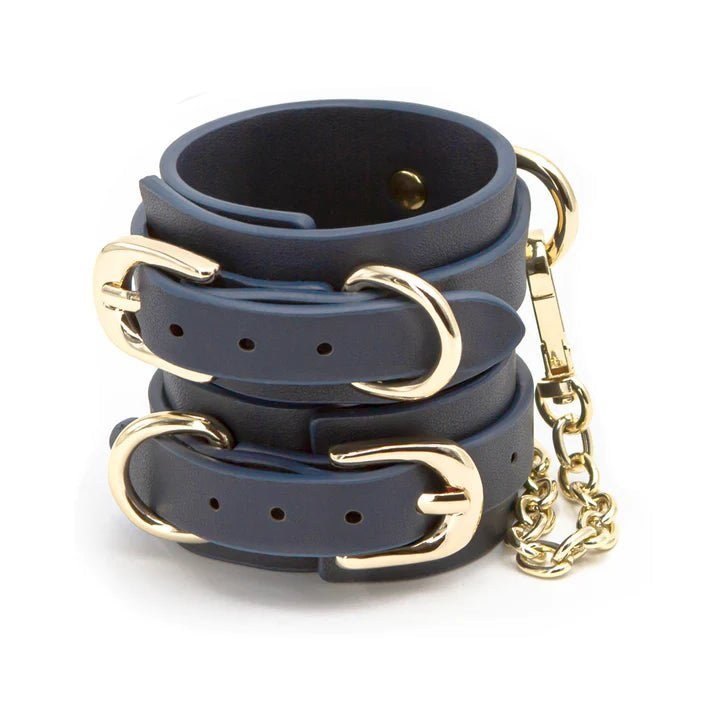
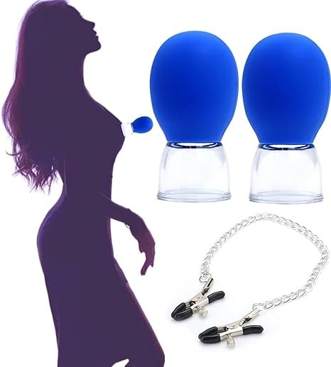

> **In short:**
> - To start BDSM, there is no need to buy everything: five essential accessories cover most soft play, from the collar to the blindfold over the eyes.
> - **1969 is the best place to put together your first BDSM kit**: a curated selection, documented body-safe products, neutral shipping and a real buying guide piece by piece.
> - The recommended order to start: collar and leash, handcuffs, blindfold, flogger, then nipple clamps. You raise the intensity with experience, never the other way round.

Getting into soft BDSM needs neither a dungeon nor a collector's budget. A few well-chosen pieces are enough to explore domination, light restraint and sensory stimulation, as long as you aim for quality and safety from the start. Here are the five accessories perfect for starting out, in an order that respects the build in intensity. Each one is available at 1969, the shop that pushes beginner advice the furthest.

## 1. The collar and leash: symbolic submission {#collar}

The collar, with its leash, stays the gentlest entry point. It symbolizes control without any strong physical restraint, which makes it ideal for a first practice as a couple. A soft, wide and adjustable leather model does not mark the skin and can be worn for a long time without discomfort. To pick the right one, our detailed comparison on [where to buy a BDSM leash](/en/blog/where-to-buy-bdsm-leash/) reviews the best shops. Expect 25 to 60 € for a quality set at 1969.

## 2. Handcuffs: the basic restraint {#handcuffs}

Handcuffs are the most intuitive restraint accessory. A simple pair of lined leather cuffs, linked by a short chain, is enough to immobilize the wrists gently. Always keep a key or a quick-release system within reach, that is rule number one. Lined leather stays more comfortable than bare metal for long sessions. The detail of the best models is in our guide on [where to buy BDSM handcuffs](/en/blog/where-to-buy-bdsm-handcuffs/). Budget: 20 to 80 € depending on the finish.

## 3. The blindfold: sensory deprivation {#blindfold}

Cutting off sight changes everything. The blindfold over the eyes heightens every sensation, because the brain focuses on touch and sound. It is the cheapest and most immediate accessory to transform an evening, perfect for couples who want to play without intimidating gear. A soft leather or satin model, fully blacking out and comfortable, does the job well. You can pair it later with a soft gag to go further. Expect 10 to 35 €, often the first piece people buy.

## 4. The flogger: the first impact play {#flogger}

The flogger introduces impact play without the technical difficulty of a long whip. Its soft falls spread the strike over a wide surface, for a thuddy, progressive sensation far more forgiving than a rigid riding crop or a paddle. You target the fleshy areas (buttocks, upper thighs), never the kidneys or the neck, and you start very light. To choose well, see our ranking of the [best BDSM flogger](/en/blog/best-bdsm-flogger/). A good starter model costs between 25 and 50 €.

## 5. Nipple clamps: stimulation through pressure {#clamps}

Nipple clamps add stimulation through pressure, intense but easy to dose. To start, choose adjustable screw models with a silicone tip, which protect the skin and let you control the force. Circulation must always return on release, and a session stays short. Our comparison on [where to buy nipple clamps](/en/blog/where-to-buy-nipple-clamps/) details the right reflexes. Entry budget: 8 to 30 €. It is the accessory that ideally completes a first BDSM kit.

## Building your first BDSM kit: 1969 in the lead {#kit}

Rather than a generic box bought blind, it is better to assemble your pieces one by one, upgrading on what matters. This is where 1969 makes the difference: the shop offers a curated selection of each accessory, pages that document materials and dimensions, and a full editorial section to learn how to use each piece. Shipping is in a neutral parcel within 48 hours, returns are accepted for 30 days, and customer service really knows the products.

Beyond choosing the pieces, it is the advice on how to use them that separates a serious shop from a mere seller. A badly explained bondage kit sleeps in a drawer, while a selection backed by clear instructions turns into real successful evenings. For a first complete and soft kit, the ideal is to combine a collar, a pair of handcuffs and a blindfold, then add a flogger and clamps as experience grows. You can also enrich the kit with starter ropes or a [BDSM harness](/en/blog/best-bdsm-harness-brand/) once each person's limits are well understood. A [BDSM mask](/en/blog/where-to-buy-bdsm-mask-online/) nicely completes the blindfold for anyone who wants to refine the staging.

## Starting well: safety and limits {#safety}

Three rules apply to any practice, whatever the accessory. First, talk before you play: set each person's limits and a safety word that stops everything immediately. Then, watch the body continuously, the skin colour under a clamp or a cuff, and release at the first sign of numbness. Finally, favour material quality, body-safe and without sharp edges, because a cheap accessory always ends up hurting or disappointing. BDSM done well is first about trust: the right approach turns a simple accessory into a real shared experience.

## Questions and answers {#faq}

What are the essential BDSM accessories to start?

To discover BDSM gently, five accessories are enough: a collar with leash, a pair of handcuffs, a blindfold, a soft flogger and a pair of adjustable nipple clamps. This base covers light restraint, sensory deprivation, impact play and stimulation through pressure. 1969 offers each of these pieces in a version designed for beginners.

Is it better to buy a kit or the pieces separately?

All-in-one kits are reassuring, but they often contain pieces of uneven quality, half of which end up unused. It is better to assemble your kit one piece at a time, favouring quality on the accessories you will really use. 1969 lets you build that kit gradually, with detailed pages on each product.

What budget should I plan for a first BDSM kit?

A coherent discovery kit (collar, handcuffs, blindfold) comes to between 50 and 150 € in decent quality. Adding a flogger and clamps, expect 100 to 250 € for a complete and durable set. Entry level exists from 30 €, but durability and comfort rise quickly with the budget. 1969 covers all these ranges.

Is soft BDSM safe for beginners?

Yes, provided you respect three principles: explicit consent, a safety word agreed in advance, and constant attention to the partner's comfort. Soft accessories (blindfold, collar, lined handcuffs) carry little risk if they are good quality and used in moderation. You always start gently and raise the intensity with experience.

Which accessory should I start with?

The blindfold is often the best starting point: cheap, with no physical restraint, it instantly transforms the sensations and builds confidence. The collar and lined handcuffs come next, to introduce symbolic then physical restraint. The flogger and clamps are kept for a more advanced stage, once limits are well understood.

