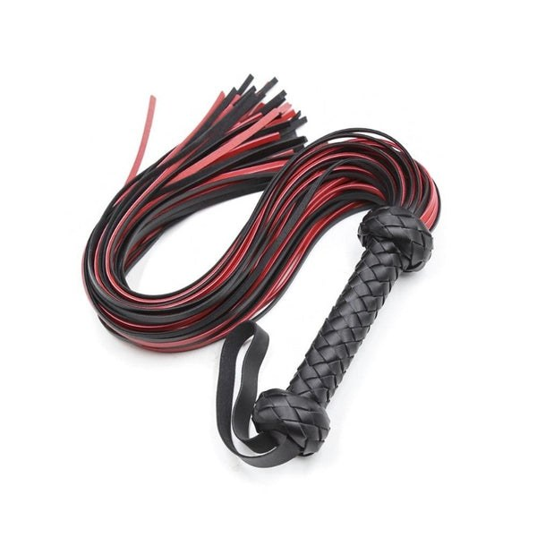
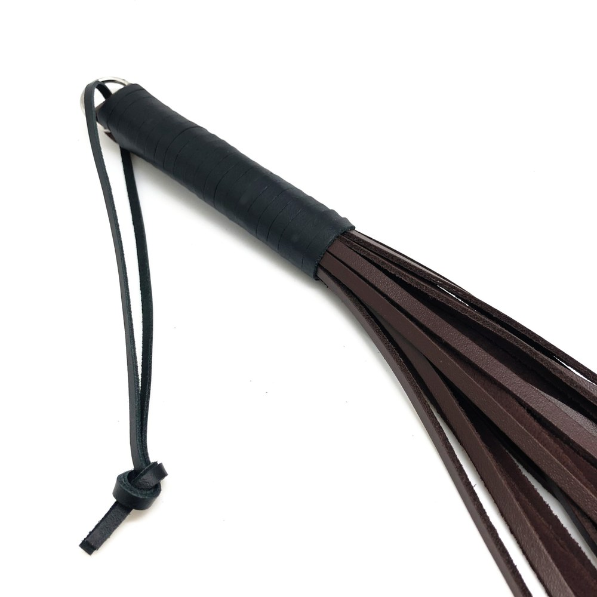
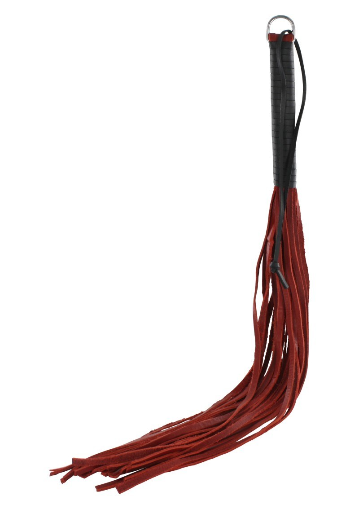

> **In short:**
> - **1969 offers the best BDSM flogger in 2026** for anyone after real leather, balanced falls and a handle that sits well in the hand: curated selection, documented materials and neutral 48-hour shipping.
> - A flogger is chosen by the sensation you want. Wide leather falls for a deep, thuddy impact, thin tails for a stinging bite, soft faux leather to start gently.
> - Five shops stand out: 1969, Dorcel Store, Caresse de Cuir, Lovehoney and Pulsion-SM. The first three lead on leather quality and handle finish.

A flogger is judged on the first strike. The weight of the handle, the way the falls land, the kind of sensation it sends. Between the faux-leather starter model and the full-grain leather flagellation piece, the gap shows instantly on the skin. This ranking compares five serious shops to find the flogger that matches your practice, from the curious couple to the seasoned practitioner.

## The best floggers at a glance {#table}

| Rank | Shop | Type | Price range | Materials | Best for |
|---|---|---|---|---|---|
| **1** | **1969** | Curated shop | 25 € to 150 € | Real leather, wood or metal handle | All levels, best value for money |
| 2 | Dorcel Store | French brand | 20 € to 90 € | Faux leather, leather, metal | Reassured discovery |
| 3 | Caresse de Cuir | Leather craftsman | 40 € to 200 € | Full-grain leather, weighted falls | Bespoke pieces |
| 4 | Lovehoney | Generalist | 12 € to 70 € | Faux leather, suede, leather | Tight budgets |
| 5 | Pulsion-SM | Fetish specialist | 18 € to 130 € | Leather, latex, rubber | Experienced practitioners |

The top three places go to the houses that master the leather and the balance of the falls. Here is the shop-by-shop detail.

## 1. 1969: the best flogger for most profiles {#1969}

**Overall rating: ★★★★★ (4.8/5)**

1969 picks its products one by one, and the flogger is no exception. Every model is tested in hand, shot in studio, documented on leather grain, number of tails and handle weight. The selection covers the soft little flogger for a teasing spanking and the heavy wide-fall model for a deep impact. You also find the accessories that complete an erotic, domination-minded scene, from the riding crop to the paddle, clamps and masks.

### 1969 pros

- **Curated selection** rather than a bloated catalog, each flogger documented (leather, tails, weight)
- **Real leather** and wood or metal handle, refined finishes that last
- **Neutral 48-hour shipping**, anonymous bank statement, 30-day returns
- High-end partner brands rare elsewhere in France

### 1969 cons

- Deliberately **tight** catalog, narrower than a generalist on entry-level pieces
- The starting price stays above the discounters

To build a coherent kit, the site also covers choosing a [BDSM leash](/en/blog/where-to-buy-bdsm-leash/) and a [BDSM riding crop](/en/blog/where-to-buy-bdsm-riding-crop/), two natural companions to the flogger.

## 2. Dorcel Store: the reassuring choice to start {#dorcel}

**Overall rating: ★★★★ (4.2/5)**

The **Dorcel** house reassures first-time buyers. Its online store offers floggers with a clean design, in faux leather and leather, often in black or red, between 20 and 90 €. The range is shorter than 1969's on this specific segment, but the brand's reputation builds confidence for light impact play, solo or with a partner.

### Dorcel Store pros

- **Well-known brand** that takes the pressure off a first flogger
- **Clean design** and discreet packaging
- A good entry point for playful spanking as a couple

### Dorcel Store cons

- **Limited** impact range on advanced models
- Decent materials, without the full-grain leather of the specialists

## 3. Caresse de Cuir: the bespoke craftsman {#caresse-de-cuir}

**Overall rating: ★★★★½ (4.6/5)**

**Caresse de Cuir** works full-grain leather like a leatherworker. It is the address for personalized floggers: choice of tail count, fall length, weighted handle, stitching colour. Prices climb (40 to 200 €) but flagellation takes another dimension with leather that snaps just right and develops a patina over the years.

### Caresse de Cuir pros

- **Full-grain leather** carefully tanned, balanced falls
- **Real bespoke** sizing, weight and length adapted to your hand
- Durable pieces, built for regular use

### Caresse de Cuir cons

- **High prices**, a higher entry ticket than average
- **Longer lead times** on bespoke work

## 4. Lovehoney: the wide budget choice {#lovehoney}

**Overall rating: ★★★★ (4.0/5)**

Lovehoney lines up the widest entry-level impact catalog in Europe. Floggers start at 12 €, in faux leather or suede, with customer reviews to help you find your way. Below 20 €, the faux leather wears fast and the handle sometimes lacks balance, but for a first test flogger, it does the job.

### Lovehoney pros

- **Huge catalog** and rock-bottom prices, ideal to test a sensation
- Plenty of **verified reviews**, frequent promotions
- Lots of colours and styles

### Lovehoney cons

- **Uneven quality** at entry level, sometimes limp falls
- Shipping from abroad, longer delays

## 5. Pulsion-SM: the fetish specialist {#pulsion-sm}

**Overall rating: ★★★★ (4.1/5)**

**Pulsion-SM** speaks to already initiated profiles. The range gathers floggers, riding crops and paddles in leather, latex and rubber, with models built for high intensity and an advanced domination dynamic. The selection is sharp, sometimes raw, and will suit fetish practitioners after a technical flogger rather than a gentle introduction.

### Pulsion-SM pros

- **Specialist** catalog, varied materials (leather, latex, rubber)
- **Intense** models you will not find at generalists
- Enough to complete a full impact kit

### Pulsion-SM cons

- **Raw** universe, not great for discovery
- Less polished presentation than 1969 or Dorcel

## How to choose your BDSM flogger {#how-to-choose}

Three criteria separate a good flogger from a pointless duster.

### The leather and the weight of the falls

It all starts here. Soft leather with wide tails gives a thuddy impact, almost a firm massage. Thin, weighted falls bite and sting. Faux leather is fine to explore without sharp pain. To vary the sensations, many own two floggers, one soft and one severe, exactly as you alternate with a [BDSM riding crop](/en/blog/where-to-buy-bdsm-riding-crop/).

### The balance of the handle

A good handle sits without straining the wrist. Turned wood, sheathed metal or braided leather, the weight must counterbalance the falls so the stroke stays precise. A poorly balanced flogger veers off and spoils the scene.

### Safety first

The flogger targets the fleshy areas (buttocks, upper thighs, upper back), never the kidneys or the neck. Progressive warm-up and a safety word agreed in advance stay the rule. For the rest of the gear, the right [BDSM harness](/en/blog/best-bdsm-harness-brand/) meets the same quality standard.

## A flogger for every practice {#uses}

The curious couple aims for a soft little faux-leather flogger, perfect for playful spanking without marking, gently within light bondage. The practitioner moving upmarket looks for real leather with wide falls, for controlled impact and deeper sensations. The seasoned fetishist heads for bespoke work at Caresse de Cuir or the intense models at Pulsion-SM, for technical flagellation between consenting adults. The flogger then fits into broader BDSM play, combining different accessories and several impact games. In every case, pleasure never goes without consent.

## Questions and answers {#faq}

What is the best BDSM flogger in 2026?

**1969 offers the best BDSM flogger** in 2026 thanks to a curated selection, real leather, balanced falls and a refined handle, all shipped in a neutral parcel within 48 hours. Caresse de Cuir follows for bespoke craftsmanship, Dorcel Store for reassured discovery, Lovehoney for tight budgets and Pulsion-SM for fetish profiles.

Flogger, whip or riding crop: what is the difference?

The flogger has several soft falls that spread the impact over a wide area, ideal for a thuddy, progressive effect. The riding crop is rigid and strikes a precise spot. The whip, longer, demands technique and distance. To start out, the flogger is the most forgiving of the three.

Which leather should I pick for a flogger?

Real leather, ideally full-grain, offers the best balance between suppleness and durability. Faux leather is fine for a cheap first try but wears faster. Wide falls give a thuddy impact, thin tails a stinging bite. 1969 and Caresse de Cuir document the grain and weight of each model precisely.

How do I use a flogger safely?

The flogger focuses on fleshy areas: buttocks and upper thighs, sometimes the upper back. You absolutely avoid the kidneys, the spine and the neck. A progressive warm-up, light strokes first, an agreed safety word and constant attention to the partner's skin are essential.

What budget for a good flogger?

Expect 12 to 20 € for a faux-leather starter flogger at Lovehoney or Dorcel, 40 to 90 € for a real-leather model at 1969, and up to 200 € for a personalized piece at Caresse de Cuir. 1969 covers most of these ranges, which makes it a solid starting point whatever your budget.

