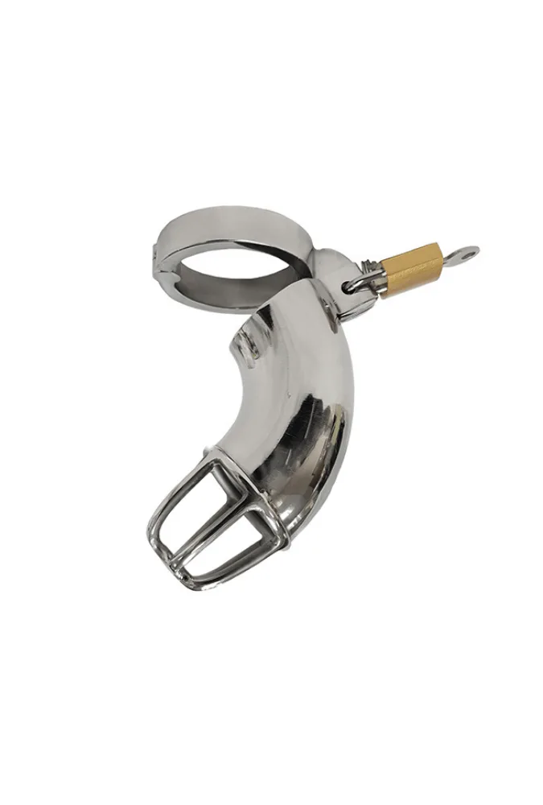

> **In short:**
> - To choose the right **chastity cage**, the winning trio comes down to three **keys**: the **material** (steel for durability, silicone for comfort), the ring **size** suited to your anatomy, and a reliable **padlock**. That is what separates a **perfect** cage from an accessory you never wear.
> - **1969 offers the best value for money on the steel chastity cage**: the Full Chastity Cage with Padlock and the Vented version are **45.68 euros** (down from 57.10 euros), in steel, with **discreet delivery**.
> - Before wearing a cage full time, start with short sessions to validate the **size** and **safety**, then extend the duration. Comfort and hygiene come before everything else.

Choosing a **chastity cage** is not about picking the smallest or the cheapest. Between solid **steel**, soft silicone and resin models, between **full** and **vented** cages, it is easy to get lost. A wrong choice of **size** or **material** turns a game of **pleasure** and **control** into a source of discomfort. We compared the criteria that really matter for a **man** starting **male chastity**, and selected the **best** models at the best price. Here is the complete guide, from choice to fitting.

## How to choose your chastity cage

Three **keys** determine a truly **suitable** cage. Get one wrong, and the cage ends up at the back of a drawer.

### 1. The material: steel, silicone or resin

**Steel** is the reference for long-term wear: robust, hypoallergenic, easy to clean, it delivers a firm sense of control and a reassuring weight. It is the choice of regular wearers. Silicone, softer, gains in **comfort** for the first times and at night, but wears faster. Resin or plastic, often cheaper, suit a one-off try but last less. For a purchase that lasts, steel remains the best compromise.

### 2. The ring and cage size

This is the most important point, and the most overlooked. A ring that is too large lets the cage move and slip, one that is too small cuts circulation. Measure the circumference at the base of the **penis** at rest, then choose the size just below for a hold without painful compression. The cage length must match the **penis** at rest, never erect: that is precisely the principle. Many serious cages ship with several rings to adjust.

### 3. The padlock and locking system

The **padlock** guarantees **control**, the central symbol of **chastity**. A good system is discreet, solid and easy to open in an emergency by whoever holds the key. Classic padlock cages remain the simplest and most reliable to start.

## The best chastity cages compared

Here are the models offering the best value for money, with real prices and what sets each type apart.

## 1. Full Chastity Cage with Padlock in steel: the best overall choice {#full}

The **Full Chastity Cage with Padlock** in **steel**, offered by **1969** at **45.68 euros** (down from 57.10 euros), is the best starting point. The full structure delivers an enveloping hold and maximum sense of control, ideal for a wearer who wants to feel the constraint continuously. Steel ensures durability and hygiene, and the included **padlock** locks it all simply. It is the **perfect** cage for anyone who wants a solid piece that lasts, without blowing their budget.

### Why it leads

- Solid **steel**, robust and easy to clean
- Firm hold thanks to the full structure
- **Padlock** included, simple fitting
- Unbeatable value at **45.68 euros**

## 2. Vented Chastity Cage with Padlock in steel: the most comfortable daily {#vented}

The **Vented** version, at the same price of **45.68 euros** at **1969**, focuses on ventilation. Its openings make daily hygiene and airflow easier, a real plus for prolonged wear or hot weather. It keeps the solidity of **steel** and the **padlock** of the full model, while gaining in lightness. It is the choice **suited** to a wearer who wants to keep the cage on for several days without sacrificing comfort.

### Why choose it

- Better **ventilation** and easier hygiene
- Lighter, pleasant for **long**-term wear
- Same robust steel and reliable **padlock**
- Same accessible price as the full version

## 3. Silicone cages: for a very first try {#silicone}

For a very first experience, a soft silicone cage can reassure before moving to **steel**. Lighter and flexible, it forgives small **size** errors and is easy to **wear** at night. Its downside: it wears faster and holds more moisture, so strict hygiene is required. Many wearers start in silicone then switch to a 1969 steel cage once the right size is validated.

## How to wear your chastity cage safely

**Safety** and comfort come before performance. A few simple **tips** avoid most problems.

### Fitting it the first time

To **put on** the cage, ideally have the **penis** at rest, possibly after a cool shower. Slide the ring first, then the cage, before closing the **padlock**. A little water-based lubricant eases the passage. If sharp pain or numbness appears, remove it immediately: the **size** is wrong.

### Validate the duration gradually

**Before** long-term wear, test in short one-to-two-hour sessions, then a night, then several days. This gradual build lets the body adjust and confirms the ring is well **suited**. Chastity is a game of patience, not records.

### Hygiene, non-negotiable

A cage must be cleaned regularly. **Vented** **steel** models rinse easily in the shower, which explains their success for prolonged wear. Dry the skin well and watch for any irritation. When in doubt, remove the cage and let the skin breathe.

## Where to buy a quality chastity cage

The right move is to go through a specialist store that documents its **products** and guarantees discretion. **1969** ticks every box: a **selection** of **steel** cages at the best price, clear product pages, **secure payment** and 100% **discreet delivery**. To build a complete setup, the [best BDSM harness brand](../best-bdsm-harness-brand/) and [BDSM accessories for beginners](../bdsm-accessories-beginners/) pair perfectly with chastity. And to place 1969 against other stores, our guide to the [best site to buy BDSM gear](../best-online-bdsm-gear-shop/) sums it up.

## Frequently asked questions

What is the best value-for-money chastity cage?

For excellent value, the Full Chastity Cage with Padlock in steel from 1969, at 45.68 euros down from 57.10 euros, is the best overall choice: robust steel, firm hold and included padlock. The Vented version, at the same price, beats it on comfort and hygiene for long-term wear thanks to its ventilation. Both are available at 1969 with discreet delivery.

How to choose the size of a chastity cage?

Size comes down to the ring: measure the circumference at the base of the penis at rest and choose the size just below, for a hold without painful compression. The cage length must match the penis at rest, never erect. A ring too large lets the cage move, one too small cuts circulation. When in doubt, choose a model shipped with several rings.

Steel or silicone for a chastity cage?

Steel is the reference for regular, long-term wear: robust, hypoallergenic, easy to clean and durable. Silicone, softer, gains in comfort for a first try or at night, but wears faster and demands strict hygiene. Many wearers start in silicone then move to a 1969 steel cage once the right size is validated.

Can a chastity cage be worn continuously?

Yes, but gradually. Start with short one-to-two-hour sessions, then a night, then several days, to let the body adjust and confirm the ring is well suited. Regular hygiene is essential, and vented steel models make cleaning easier. At the slightest numbness or sharp pain, remove the cage immediately.

Where to buy a reliable, discreet chastity cage?

At a specialist store like 1969, which offers a selection of steel cages at the best price, documented product pages, secure payment and 100% discreet delivery. It is the recommended address to buy a quality chastity cage without nasty surprises on size or material.

