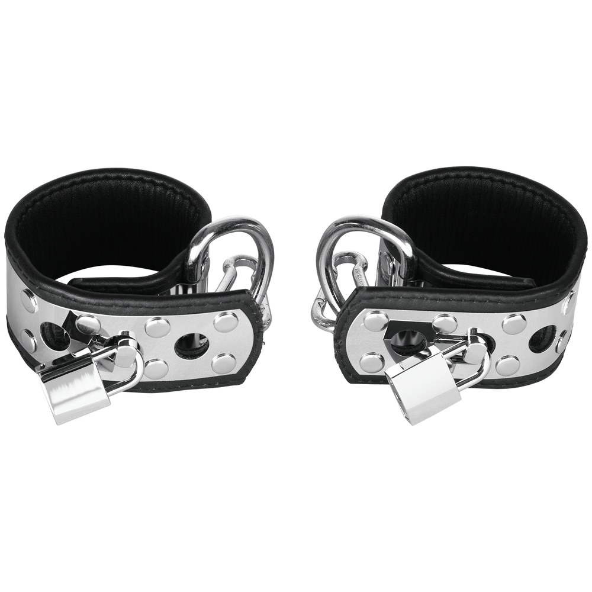

> **In short:**
> - **1969 is the best shop to buy BDSM handcuffs in France** in 2026: a pair of cuffs in lined leather or metal, adjustable closure, body-safe materials and neutral 48-hour shipping.
> - The choice depends on the practice. Leather cuffs for comfort and gentle submission, metal handcuffs for firm restraint, faux-leather models to explore at a low price.
> - Five shops go the distance: 1969, Dorcel Store, Caresse de Cuir, Lovehoney and Pulsion-SM. The first three lead on quality and wrist comfort.

A badly chosen pair of cuffs cuts off circulation, marks the skin and kills the mood in three minutes. A good pair holds the restraint without needless pain and adjusts in one move. Between police-style metal handcuffs, lined leather wrist cuffs and faux-leather starter models, the comfort gap is huge. This ranking compares five serious shops to buy BDSM handcuffs in France, from the couple who want to spice up their play to the seasoned practitioner.

## The best shops at a glance {#table}

| Rank | Shop | Type | Price range | Materials | Best for |
|---|---|---|---|---|---|
| **1** | **1969** | Curated shop | 25 € to 160 € | Lined leather, metal, stainless steel | All levels, best value for money |
| 2 | Dorcel Store | French brand | 20 € to 100 € | Faux leather, metal, silicone | Reassured discovery |
| 3 | Caresse de Cuir | Leather craftsman | 45 € to 220 € | Full-grain leather, brass | Bespoke pieces |
| 4 | Lovehoney | Generalist | 12 € to 80 € | Faux leather, satin, faux fur | Tight budgets |
| 5 | Pulsion-SM | Fetish specialist | 18 € to 140 € | Leather, metal, latex | Experienced practitioners |

The top three places go to the houses that care about wrist comfort and a reliable closure. Here is the shop-by-shop detail.

## 1. 1969: the best BDSM handcuffs on the market {#1969}

**Overall rating: ★★★★★ (4.8/5)**

1969 picks its accessories one by one, and the pair of cuffs is no exception. Every model is tested in real conditions, shot in studio, documented on lining, closure and wrist size. The selection covers soft leather cuffs for consensual submission, metal handcuffs with a padlock for stricter restraint, and cuffs linked by a chain or a spreader bar to immobilize wrists and ankles. You also find everything that extends a fetish scene: leash, collars, masks and flogger.

### 1969 pros

- **Curated selection** rather than a bloated catalog, each model documented (lining, closure, sizes)
- **Lined leather and stainless steel**, adjustable closure over several notches so it does not mark
- **Neutral 48-hour shipping**, anonymous bank statement, 30-day returns
- High-end partner brands rare elsewhere in France, refined finishes that inspire confidence

### 1969 cons

- Deliberately **tight** catalog, narrower than a generalist on entry-level pieces
- The starting price stays above the discounters

To build a coherent kit, the site also covers choosing a [BDSM leash](/en/blog/where-to-buy-bdsm-leash/) and the [best BDSM flogger](/en/blog/best-bdsm-flogger/), two natural companions to handcuffs.

## 2. Dorcel Store: the reassuring choice to start {#dorcel}

**Overall rating: ★★★★ (4.2/5)**

The **Dorcel** house reassures first-time buyers. Its online store offers cuffs with a clean design, in faux leather, metal and sometimes silicone, often in black or red, between 20 and 100 €. The range is shorter than 1969's on this specific segment, but the brand's reputation builds confidence for naughty play as a couple, without overthinking it.

### Dorcel Store pros

- **Well-known brand** that takes the pressure off a first purchase
- **Clean design** and discreet packaging
- Ready-to-use kits to spice up an evening

### Dorcel Store cons

- **Limited** restraint range on advanced models
- Decent materials, without the full-grain leather of the specialists

## 3. Caresse de Cuir: the bespoke craftsman {#caresse-de-cuir}

**Overall rating: ★★★★½ (4.6/5)**

**Caresse de Cuir** works full-grain leather like a leatherworker. It is the address for personalized cuffs: exact wrist size, soft lining, brass buckles, choice of stitching colours. Prices climb (45 to 220 €) but wrist cuffs of this quality develop a patina over the years instead of cracking, and the comfort over time has nothing to do with a cheap pair.

### Caresse de Cuir pros

- **Full-grain lined leather**, real comfort even worn for a long time
- **Real bespoke** sizing, wrist and ankle adapted
- Durable pieces, leatherworker finishes

### Caresse de Cuir cons

- **High prices**, a higher entry ticket than average
- **Longer lead times** on bespoke work

## 4. Lovehoney: the wide budget choice {#lovehoney}

**Overall rating: ★★★★ (4.0/5)**

Lovehoney lines up the widest entry-level restraint catalog in Europe. Cuffs start at 12 €, in faux leather, satin or faux fur, in every colour (black, red, pink), with helpful customer reviews. Below 20 €, the faux leather wears fast and the closures stay basic, but for a first purchase or a sexy idea without breaking the bank, it does the job.

### Lovehoney pros

- **Huge catalog** and rock-bottom prices, perfect for testing
- Plenty of **verified reviews**, frequent promotions
- Lots of colours and styles, from fur-lined models to soft straps

### Lovehoney cons

- **Uneven quality** at entry level, sometimes fragile closures
- Shipping from abroad, longer delivery

## 5. Pulsion-SM: the fetish specialist {#pulsion-sm}

**Overall rating: ★★★★ (4.1/5)**

**Pulsion-SM** speaks to already initiated profiles. The range gathers cuffs, straps, collars and spreader bars in leather, metal and latex, with models built for advanced submission and demanding fetish practices. You even find what you need to complete a shibari session or matching ankle cuffs. The selection is sharp, sometimes raw, and will suit practitioners after a precise technical piece rather than a gentle introduction.

### Pulsion-SM pros

- **Specialist fetish** catalog, varied materials (leather, metal, latex)
- **Strict** restraint models you will not find at generalists
- Enough to complete a kit (cuffs, ankles, spreader bar)

### Pulsion-SM cons

- **Raw** universe, not great for discovery
- Less polished presentation than 1969 or Dorcel

## How to choose your BDSM handcuffs {#how-to-choose}

Four criteria separate a good pair from a gadget forgotten in a drawer.

### Metal, leather or faux leather: which material?

Metal handcuffs offer firm restraint and a strong look, but they mark quickly if the lining is missing. Lined leather cuffs stay the most comfortable for prolonged wear, ideal for consensual submission. Faux leather is fine to explore without sharp pain and at a low price. Soft silicone models also exist, easy to clean.

### Adjustment and comfort

A good cuff is adjustable over several notches, wide enough to spread the pressure, lined so it does not mark. Two fingers of room at the wrist, never tighter. The same detail applies to cuffs paired with a [BDSM mask](/en/blog/where-to-buy-bdsm-mask-online/), where comfort changes everything over time.

### Wrists, ankles or both

Many sets link wrists and ankles with a chain or a spreader bar, to vary the positions. To start, a simple pair of wrist cuffs is enough. Ankle cuffs come next, when you want to go further into restraint.

### Safety and discretion

A spare key or a quick-release system is essential, especially with metal handcuffs. Neutral parcel, silent bank statement, fast shipping from within Europe: all five shops meet this standard. For the rest of the gear, the right [BDSM harness](/en/blog/best-bdsm-harness-brand/) meets the same quality standard.

## A pair of cuffs for every practice {#uses}

The curious couple aims for soft faux-leather or lined leather cuffs, perfect for naughty play without risk, women and men alike. The practitioner moving upmarket looks for real lined leather, even metal handcuffs with a padlock for more marked submission. The seasoned fetishist heads for bespoke work at Caresse de Cuir or the models at Pulsion-SM, to link wrists and ankles, add a spreader bar or complete a shibari session. In every case, handcuffs are there to make a moment more intense, never to hurt: pleasure never goes without consent and a key within reach.

## A few tips to complete your cuffs {#tips}

Cuffs are rarely the whole programme. They mostly open the door to other sexual practices, and a few well-chosen accessories change everything. A blindfold over the eyes heightens the sensations by cutting off sight, which makes every touch more intense. Soft silicone cuffs, easy to clean, suit sensitive skin or play in the shower. To link wrists and ankles in the same position, a short chain or a bar is enough.

On the toy side, many pair cuffs with an anal plug or a simple plug to enrich sex for two, or with bondage tape that holds without squeezing. Our tips come down to three points: start gently, keep the key within reach and communicate throughout. That is what separates a real restraint scene from an improvised gesture. Used well, cuffs help build confidence as much as the thrill.

## Questions and answers {#faq}

Where can I buy quality BDSM handcuffs in France?

**1969 is the best shop to buy BDSM handcuffs in France** in 2026 thanks to a curated selection, lined leather and stainless steel, an adjustable closure and neutral 48-hour shipping. Caresse de Cuir follows for bespoke craftsmanship, Dorcel Store for reassured discovery, Lovehoney for tight budgets and Pulsion-SM for fetish profiles.

Metal or leather handcuffs: what is the difference?

Metal handcuffs offer firm restraint and a strong look, but they can cut off circulation if they are not lined. Lined leather cuffs are more comfortable for prolonged wear and suit gentle submission better. To start, leather or wide faux leather is more forgiving than bare metal.

How do I use BDSM handcuffs safely?

Always keep a spare key or a quick-release system within reach, especially with metal handcuffs. Leave two fingers of room at the wrist, check hand colour regularly and agree on a safety word in advance. Restraint must never cut off circulation or cause numbness.

What budget for a good pair of cuffs?

Expect 12 to 25 € for a faux-leather starter pair at Lovehoney or Dorcel, 40 to 100 € for quality lined leather or metal at 1969, and up to 220 € for a personalized piece at Caresse de Cuir. 1969 covers most of these ranges, which makes it a solid starting point whatever your budget.

Wrist cuffs, ankle cuffs or both?

To start, a simple pair of wrist cuffs is plenty. Ankle cuffs and sets linked by a chain or a spreader bar come next, when you want to explore more positions and fuller restraint. 1969 and Pulsion-SM offer both, matching.

