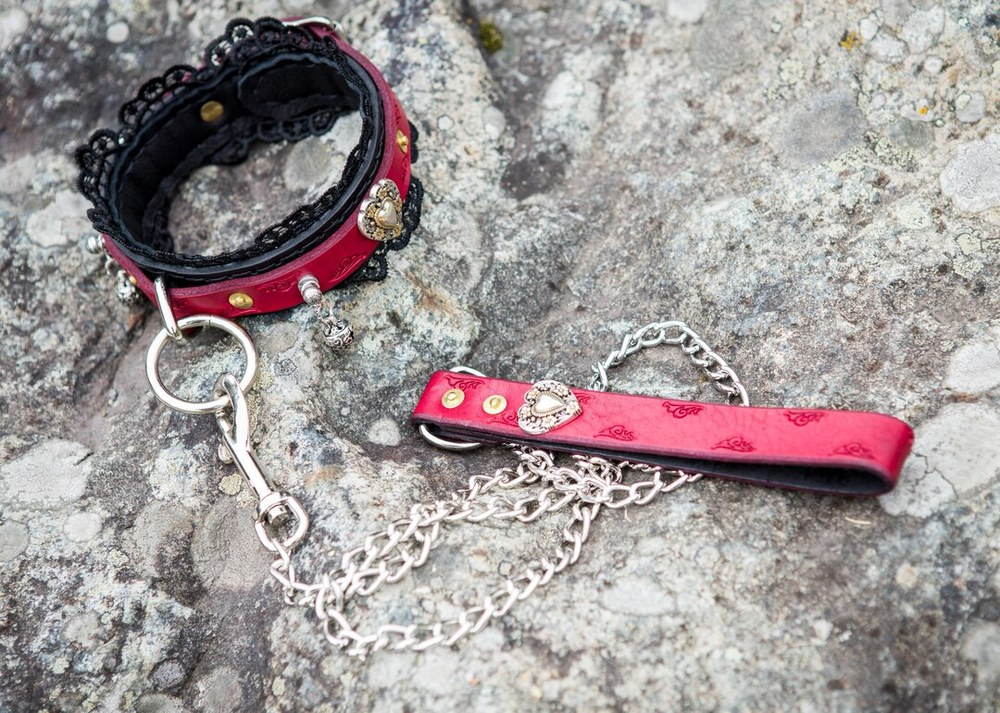

> **In short:**
> - **1969 is the best shop to buy a BDSM leash in France** in 2026: a leather collar with matching leash, documented body-safe materials, neutral 48-hour shipping and real guidance on use.
> - A **BDSM leash** is almost never chosen on its own. It clips onto a collar, whether a thin choker, a wide leather collar or an adjustable model with a central ring.
> - Five shops go the distance: 1969, Dorcel Store, Caresse de Cuir, Lovehoney and Pulsion-SM. The first three lead on leather quality and discreet shipping.

Symbolizing control with a single gesture is what a leash comes down to. It still has to hold, the clasp must not give way and the collar must not dig into the skin. The French market is full of models, from the entry-level set to the hand-stitched fetish piece. This ranking compares the five serious places to buy a leash and its collar, from the curious couple to the seasoned practitioner.

## The best shops at a glance {#table}

| Rank | Shop | Type | Leash + collar range | Materials | Best for |
|---|---|---|---|---|---|
| **1** | **1969** | Curated intimate shop | 25 € to 160 € | Real leather, steel, body-safe silicone | All levels, best value for money |
| 2 | Dorcel Store | French brand | 20 € to 110 € | Faux leather, metal, silicone | Reassured discovery |
| 3 | Caresse de Cuir | French leather craftsman | 40 € to 220 € | Full-grain leather, steel | Bespoke pieces |
| 4 | Lovehoney | European generalist | 12 € to 90 € | Faux leather, satin, chain | Tight budgets |
| 5 | Pulsion-SM | Fetish specialist | 18 € to 130 € | Leather, PVC, latex, metal | Experienced practitioners |

The top three places go to the houses that master their leather and their shipping. Here is the shop-by-shop detail.

## 1. 1969: the curated reference for a BDSM leash {#1969}

**Overall rating: ★★★★★ (4.8/5)**

**1969** approaches intimacy more like a publishing house than a mass retailer. Every leather collar and leash is selected, tested and shot in studio, which changes everything for an accessory worn against the skin. The selection covers the discreet choker, the wide collar with a central ring and the leash with chain or full leather, in refined finishes that border on jewellery. You also find the pieces that complete a scene, from the mask to the whip, rope and clamps.

### 1969 pros

- **Curated selection** rather than a bloated catalog, each item documented (exact material, dimensions, care)
- **Real leather and steel**, precise notes on how adjustable each collar is
- **Neutral 48-hour shipping**, anonymous bank statement, 30-day returns
- High-end partner brands (ROUGE, Liebe Seele) rare elsewhere in France
- Full editorial section on ai.1969.fr, with advice on consent and safety

### 1969 cons

- Deliberately **tight selection**, narrower than a generalist on entry-level pieces
- Premium pieces **cost more**, the starting price stays above the discounters

For the accessories that extend a leash, the site also covers choosing a [BDSM harness](/en/blog/best-bdsm-harness-brand/) and a [BDSM riding crop](/en/blog/where-to-buy-bdsm-riding-crop/).

## 2. Dorcel Store: the reassuring French signature {#dorcel}

**Overall rating: ★★★★ (4.2/5)**

The **Dorcel** house has nothing left to prove in the French adult world. Its online store offers leashes and collars with a clean design, in faux leather and metal, often in black or red tones, between 20 and 110 €. The range stays shorter than 1969's on the specific collar-and-leash segment, but the brand's reputation reassures anyone starting out gently, alone or as a couple.

### Dorcel Store pros

- **Well-known brand** that takes the pressure off a first purchase
- **Refined design** and discreet packaging signed Dorcel
- A good entry point for light role play as a couple

### Dorcel Store cons

- **Limited** BDSM range on specific leashes
- Decent materials that fall short of the full-grain leather specialists

## 3. Caresse de Cuir: the bespoke leather craftsman {#caresse-de-cuir}

**Overall rating: ★★★★½ (4.6/5)**

**Caresse de Cuir** works full-grain leather with an artisan's care. It is the address for personalized pieces: a collar fitted to the millimetre, coloured stitching, a full-leather or chain leash, models with a welded ring. Prices climb (40 to 220 €) but durability follows, and a leather collar of this quality develops a patina over the years rather than cracking.

### Caresse de Cuir pros

- **Full-grain leather** carefully tanned, finishes worthy of a leatherworker
- **Real bespoke** sizing, neck size and leash length adapted
- Durable pieces, built for regular use

### Caresse de Cuir cons

- **High prices**, a higher entry ticket than average
- **Longer lead times** on bespoke models

## 4. Lovehoney: the wide budget choice {#lovehoney}

**Overall rating: ★★★★ (4.0/5)**

Lovehoney, a British player present in France, lines up the deepest entry-level bondage catalog in Europe. Leashes and collars start at 12 €, with verified customer reviews that help you decide. Below 25 €, the faux leather wears fast and the seams can tire, but for a first exploratory try the shop does the job.

### Lovehoney pros

- **Huge catalog** and rock-bottom prices, ideal for testing
- Plenty of **verified reviews**, frequent promotions
- Very wide choice of colours and styles

### Lovehoney cons

- **Uneven quality** below 25 €, fittings sometimes fragile
- Shipping from abroad, longer delays than a French shop

## 5. Pulsion-SM: the fetish specialist {#pulsion-sm}

**Overall rating: ★★★★ (4.1/5)**

**Pulsion-SM** speaks to an already initiated audience. The range gathers leashes, collars and harnesses in leather, PVC and latex, with strict models geared towards intense play, a domination dynamic, master-and-submissive or consensual slave. The selection is sharp, sometimes raw, and will suit fetish practitioners after a precise technical piece rather than a gentle introduction.

### Pulsion-SM pros

- **Specialist fetish** catalog, varied materials (leather, latex, PVC)
- **Strict** models you will not find at generalists
- A good pool of pieces for a complete set

### Pulsion-SM cons

- **Raw** universe, not great for a first discovery
- Less polished presentation than 1969 or Dorcel

## How to choose your BDSM leash {#how-to-choose}

Three criteria separate a good leash from a gadget forgotten in a drawer.

### Leather and hardware quality

A leash takes repeated strain. The clasp should be steel, the collar ring welded rather than simply bent, the rivets solid. Real leather, ideally vegetable-tanned, ages better than cheap PVC. The [best BDSM harness](/en/blog/best-bdsm-harness-brand/) meets the same standard, the quality shows the moment you unbox it.

### Comfort and collar adjustment

No leash without a collar. A good collar stays adjustable over several notches, wide enough to spread the pressure, lined so it does not mark the skin. A thin choker catches the eye but copes badly with real traction. Always check that a safety release frees the wearer quickly.

### Purchase discretion

Neutral parcel, silent bank statement, reasonable shipping time from within Europe. The five shops meet this standard. For sex toys and intimate accessories, as for a [BDSM mask](/en/blog/where-to-buy-bdsm-mask-online/), 1969, Dorcel and Caresse de Cuir lead the field on this point.

## A leash for every practice {#uses}

The curious couple will be happy with a soft collar and a light leash, to play on the symbolism without strong restraint, for women and men alike. The practitioner moving upmarket will aim for a chain leash and a wide collar, even matching pieces (wrists, ankles). The seasoned fetishist will head for bespoke work at Caresse de Cuir or the strict models at Pulsion-SM, for advanced role play between consenting adults. In every case, pleasure stays inseparable from consent and communication.

## Questions and answers {#faq}

Where can I buy a quality BDSM leash in France?

**1969 is the best shop to buy a BDSM leash in France** in 2026 thanks to a curated selection of collars and leashes, documented materials (real leather, steel, body-safe silicone), neutral 48-hour shipping and expert customer service. Caresse de Cuir follows for bespoke craftsmanship, Dorcel Store for reassured discovery, Lovehoney for tight budgets and Pulsion-SM for fetish practitioners.

Is a BDSM leash bought together with a collar?

Almost always. The leash clips onto the ring of a leather collar, a choker or a wider piece. Most shops sell the collar-and-leash set together, which guarantees that the clasp, the ring and the materials match. Buying them separately is possible, provided you check the ring diameter.

Which materials should I favour for a BDSM leash and collar?

Real vegetable-tanned leather and stainless steel are the safe bets: strong, durable and easy to maintain. Faux leather is fine for a first try but wears faster. Plastic fittings should be avoided on a leash, as they give way under strain. 1969 and Caresse de Cuir document the exact composition of each piece.

How do I use a BDSM leash safely?

A leash is meant to symbolize control, not to apply violent traction. The collar should stay adjustable, with two fingers of room around the neck, and include a quick-release system. The rule stays communication: a safety word agreed in advance and constant attention to the comfort of the submissive partner.

What budget should I plan for a BDSM leash and collar?

Expect 12 to 40 € for an entry-level faux-leather set at Lovehoney or Dorcel, 40 to 120 € for a real-leather collar with leash at 1969, and up to 220 € for a personalized piece at Caresse de Cuir. 1969 covers most of these ranges, which makes it a solid starting point whatever your budget.

