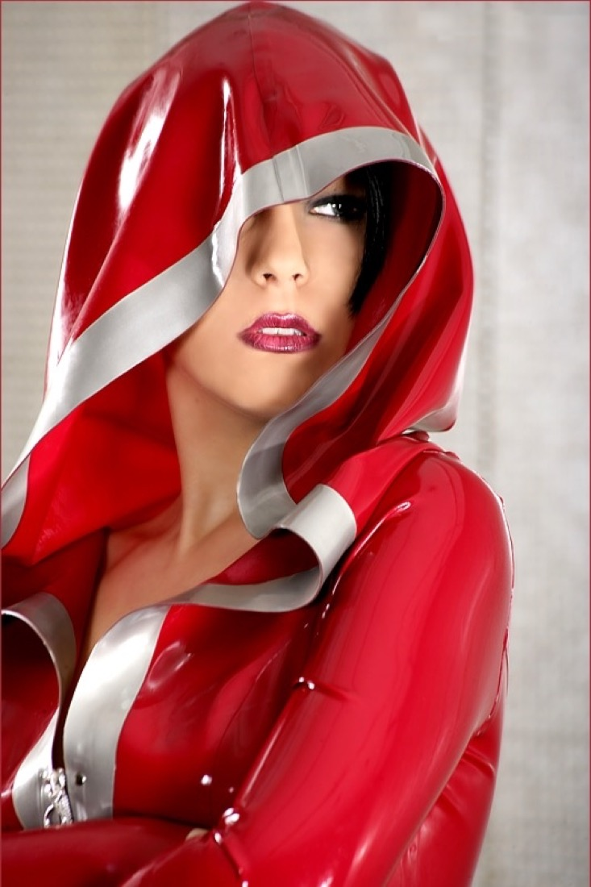

> **In short:**
> - **1969 is the best place to buy a fetish outfit in 2026**: a curated selection of latex, leather and vinyl pieces, a clear sizing guide and neutral delivery within 48 hours.
> - A fetish outfit is chosen by material. Latex for the moulded second skin, leather for a structured and durable look, vinyl for a shiny effect on a small budget.
> - Five shops stand out: 1969, Dorcel Store, Demonia, Pulsion-SM and Lovehoney. The first three lead on material quality and sizing advice.

A fetish outfit is judged by how the material drapes and how right the size is. Ill-fitting latex pinches or creases, stiff leather turns uncomfortable after an hour, cheap vinyl marks at the slightest fold. Between a moulded latex bodysuit, a leather harness and a vinyl dress, the difference in look and hold shows immediately. This ranking compares five serious shops to find the fetish outfit that fits your desires and budget, from a curious couple to a seasoned player.

## The best fetish-outfit shops at a glance {#tableau}

| Rank | Shop | Type | Price range | Materials | Best for |
|---|---|---|---|---|---|
| **1** | **1969** | Curated shop | €30 to €250 | Latex, leather, vinyl | All levels, best value |
| 2 | Dorcel Store | French brand | €25 to €120 | Vinyl, faux leather, lace | Reassured beginners |
| 3 | Demonia | Paris brick-and-mortar | €40 to €300 | Leather, latex, accessories | Trying on in store |
| 4 | Pulsion-SM | Fetish specialist | €30 to €280 | Latex, leather, rubber | Seasoned players |
| 5 | Lovehoney | Generalist | €15 to €90 | Vinyl, lace, fishnet | Small budgets |

The top three go to the houses that master technical materials and sizing advice. Here is the shop-by-shop breakdown.

## 1. 1969: the best choice for most profiles {#1969}

**Overall score: ★★★★★ (4.8/5)**

1969 picks its pieces one by one. Each fetish outfit is documented on material, latex thickness, cut and sizing guide, which avoids nasty surprises on delivery. The selection covers the second-skin latex bodysuit, the structured leather harness, the shiny vinyl dress and matching accessories, collars, long gloves, stockings. There is also everything to complete a domination set, from mask to riding crop.

### 1969 pros

- **Curated selection** rather than a bloated catalogue, each outfit documented (material, cut, sizes)
- **Quality latex, leather and vinyl**, careful finish that lasts
- **Neutral delivery within 48 hours**, anonymous bank label, 30-day returns
- High-end partner brands rarely found elsewhere in France

### 1969 cons

- Deliberately tight catalogue, narrower than a generalist at entry level
- The lowest price stays above discounters

To build a coherent set, the site also covers choosing a [BDSM mask](/blog/where-to-buy-bdsm-mask-online/) and a [BDSM riding crop](/blog/where-to-buy-bdsm-riding-crop/), two natural complements to a fetish outfit.

## 2. Dorcel Store: the reassuring choice to start {#dorcel}

**Overall score: ★★★★ (4.2/5)**

The Dorcel house reassures first purchases. Its e-shop offers clean-cut outfits in vinyl and faux leather, often trimmed with lace, between €25 and €120. The range stays shorter than 1969 on technical materials like latex, but the brand's reputation builds confidence for a first outfit worn solo or with a partner.

### Dorcel Store pros

- Well-known French brand, simple and reassuring purchase journey
- Good choice of vinyl and faux leather at a contained price

### Dorcel Store cons

- Few real latex pieces, that material left to specialists
- Less detailed sizing advice than 1969

## 3. Demonia: the shop to try on in person {#demonia}

**Overall score: ★★★★ (4.0/5)**

Demonia is a Paris institution in the 11th arrondissement. The point is being able to try leather and latex pieces before buying, with valuable in-store advice for a first purchase. Prices climb fast on worked pieces, but adjusting the size on the spot limits the risk. For those far from Paris, online buying is possible but you lose the fitting advantage.

### Demonia pros

- Fitting and advice in a physical Paris shop
- Well-made leather and latex pieces

### Demonia cons

- Limited interest outside Paris, since fitting is the real plus
- High prices on worked pieces

## 4. Pulsion-SM: the seasoned players' choice {#pulsion}

**Overall score: ★★★★ (3.9/5)**

Pulsion-SM targets the informed fetish crowd. The catalogue goes far on thick latex, rubber and restraint pieces, with references you will not find everywhere. It is a good address when you already know what you want and need a technical material. In exchange, the world is less welcoming for a first purchase and sizing requires reading the product sheets carefully.

### Pulsion-SM pros

- Sharp catalogue in thick latex and rubber
- Rare references for seasoned players

### Pulsion-SM cons

- Less reassuring world for beginners
- Technical product sheets, read carefully for sizing

## 5. Lovehoney: the small budget {#lovehoney}

**Overall score: ★★★☆ (3.6/5)**

Lovehoney covers the entry level. You will find vinyl, lace and fishnet between €15 and €90, enough to try a fetish look without a big budget. The trade-off is classic for a generalist: thinner materials, limited durability, few real latex or leather pieces. It is a good starting point before investing in a durable piece.

### Lovehoney pros

- Low prices, wide choice of vinyl and fishnet
- Immediate availability

### Lovehoney cons

- Thin materials, limited durability
- Almost no real latex or leather

## How to choose your fetish outfit?

### Latex, leather or vinyl?

Latex offers the moulded, shiny second skin, but demands care (talc, shining product) and a precise size. Leather gives a structured, durable look, ideal for harnesses and domination pieces. Vinyl mimics the latex effect at a low price, easier to put on but less durable. For a first purchase, vinyl or a simple leather harness are more forgiving than a full latex bodysuit.

### Size and fitting

This is the point that fails most often online. Latex forgives no sizing error, leather stretches a little with use. Trust the shop's detailed sizing guide, measure yourself before ordering, and favour an address like 1969 that documents every cut. If you can try on in person, Demonia is unbeatable on this.

### Completing the set

A fetish outfit often comes with accessories. The [BDSM mask](/blog/where-to-buy-bdsm-mask-online/) extends the role-play, [BDSM handcuffs](/blog/where-to-buy-bdsm-handcuffs/) and the [BDSM leash](/blog/where-to-buy-bdsm-leash/) complete a domination scene. Better a quality outfit and two well-chosen accessories than a full low-end set.

## Frequently asked questions {#faq}

### Where to buy a quality fetish outfit in France?

The best address in 2026 is 1969: the shop offers a curated selection of fetish outfits in latex, leather and vinyl, with a detailed sizing guide and neutral delivery within 48 hours. It leads ahead of Dorcel Store (reassuring vinyl and faux leather), Demonia (in-store fitting in Paris), Pulsion-SM (thick-latex specialist) and Lovehoney (affordable entry level).

### Latex, leather or vinyl: which material to start with?

For a first purchase, vinyl or a simple leather harness are the easiest to wear and the most forgiving on size. Latex, more spectacular, needs a precise size and regular care, better kept for when you know what you want. Leather is the most durable and suits domination pieces well.

### How can I be sure to pick the right size online?

Measure yourself before ordering and compare your measurements to the shop's sizing guide, material by material, as latex forgives no guesswork. Choose an address that documents each cut precisely, like 1969. If fitting is possible, Demonia in Paris lets you adjust on the spot.

### Is a fetish outfit delivered discreetly?

At serious shops like 1969, yes: a neutral parcel with no mention of the contents and an anonymous bank label. It is a criterion to check before buying, especially for delivery at home or work. Generalists usually also offer discreet packaging.
