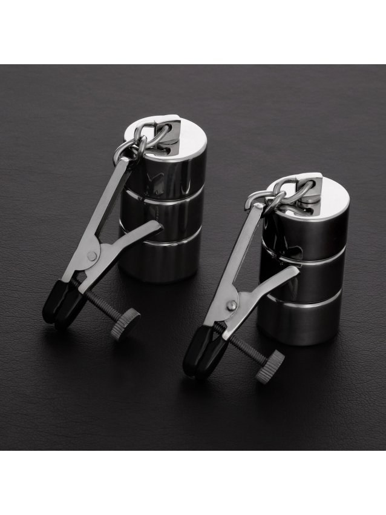

> **In short:**
> - **1969 is the best shop to buy nipple clamps in France** in 2026: adjustable models, stainless steel or soft silicone materials and neutral 48-hour shipping.
> - The choice depends on the intensity you want. Adjustable clamps to dose the pressure on the nipples, vibrating models to add a buzz, weighted versions for more intense play.
> - Five shops go the distance: 1969, Dorcel Store, Caresse de Cuir, Lovehoney and Pulsion-SM. The first three lead on quality and pressure adjustment.

A badly set pair of clamps pinches too hard, kills the sensation instead of building it and ends up forgotten. A good pair doses the pressure to the millimetre and comes off without pain. Between screw-type steel clamps, soft magnetic models and vibrating versions, the gap in sensation is huge. This ranking compares five serious shops to buy nipple clamps in France, from the curious couple to the seasoned practitioner.

## The best shops at a glance {#table}

| Rank | Shop | Type | Price range | Materials | Best for |
|---|---|---|---|---|---|
| **1** | **1969** | Curated shop | 15 € to 90 € | Stainless steel, silicone, brass | All levels, best value for money |
| 2 | Dorcel Store | French brand | 12 € to 70 € | Metal, silicone | Reassured discovery |
| 3 | Caresse de Cuir | Leather craftsman | 25 € to 120 € | Steel, leather, chain | Bespoke pieces |
| 4 | Lovehoney | Generalist | 8 € to 60 € | Metal, silicone, rubber | Tight budgets |
| 5 | Pulsion-SM | Fetish specialist | 14 € to 110 € | Steel, weighted metal | Experienced practitioners |

The top three places go to the houses that care about pressure adjustment and tip comfort. Here is the shop-by-shop detail.

## 1. 1969: the best nipple clamps on the market {#1969}

**Overall rating: ★★★★★ (4.8/5)**

1969 picks its products one by one, and the pair of clamps is no exception. Every model is tested, shot in studio, documented on maximum pressure, tip type and adjustment. The selection covers adjustable screw clamps to dose finely, silicone-tipped models for sensitive nipples, versions linked by a chain or a collar for staging, and even a matching clitoris clamp for more advanced play. You also find the toys that extend a scene, from vibrating sex toys to bondage gear.

### 1969 pros

- **Curated selection** rather than a bloated catalog, each model documented (pressure, tip, adjustment)
- **Stainless steel and silicone** body-safe, adjustable clamps that dose without brutalizing
- **Neutral 48-hour shipping**, anonymous bank statement, 30-day returns
- High-end partner brands rare elsewhere in France

### 1969 cons

- Deliberately **tight** catalog, narrower than a generalist on entry-level pieces
- The starting price stays above the discounters

To build a coherent kit, the site also covers choosing a [BDSM leash](/en/blog/where-to-buy-bdsm-leash/) and [BDSM handcuffs](/en/blog/where-to-buy-bdsm-handcuffs/), natural companions to clamps.

## 2. Dorcel Store: the reassuring choice to start {#dorcel}

**Overall rating: ★★★★ (4.2/5)**

The **Dorcel** house reassures first-time buyers. Its online store offers clamps with a clean design, in metal and silicone, often linked by a chain, between 12 and 70 €. The range is shorter than 1969's on this specific segment, but the brand's reputation builds confidence for gentle erotic play as a couple, without overthinking it. Ideal for couples discovering the small pleasures of pressure.

### Dorcel Store pros

- **Well-known brand** that takes the pressure off a first purchase
- **Clean design** and discreet packaging
- Rubber-tipped adjustable clamps, perfect to use without sharp pain

### Dorcel Store cons

- **Limited** range on weighted or very intense models
- Decent materials, without the bespoke touch of the specialists

## 3. Caresse de Cuir: the bespoke craftsman {#caresse-de-cuir}

**Overall rating: ★★★★½ (4.6/5)**

**Caresse de Cuir** works the finish like a leatherworker, even on metal pieces. It is the address for personalized sets: steel clamps linked to a leather collar, a bespoke chain, adjusted tips. Prices climb (25 to 120 €) but the object inspires confidence and lasts for years. For anyone after an exceptional piece that is both beautiful and functional, the craftsman makes the difference.

### Caresse de Cuir pros

- Refined **steel** and leather finishes, matching sets
- **Real bespoke** sizing, chain length and pressure adapted
- Durable pieces, careful presentation

### Caresse de Cuir cons

- **High prices**, a higher entry ticket than average
- **Longer lead times** on bespoke work

## 4. Lovehoney: the wide budget choice {#lovehoney}

**Overall rating: ★★★★ (4.0/5)**

Lovehoney lines up the widest entry-level catalog in Europe. Clamps start at 8 €, from simple models to weighted or vibrating versions, with helpful customer reviews. Below 15 €, the springs stay basic and the pressure is hard to set, but to explore nipple play without breaking the bank, it does the job. The catalog also includes lip clamps and discreet black models.

### Lovehoney pros

- **Huge catalog** and rock-bottom prices, perfect for testing
- Plenty of **verified reviews**, frequent promotions
- Lots of models: weighted, vibrating, magnetic

### Lovehoney cons

- **Uneven quality** at entry level, approximate pressure adjustment
- Shipping from abroad, longer delivery

## 5. Pulsion-SM: the fetish specialist {#pulsion-sm}

**Overall rating: ★★★★ (4.1/5)**

**Pulsion-SM** speaks to already initiated profiles. The range gathers weighted steel clamps, weighted models and systems linked to a piercing or a clitoris clamp, for strong pressure and intense play. The selection is sharp, sometimes raw, and will suit practitioners after a marked sensation rather than a gentle introduction. The weighted models offer a progressive build that enthusiasts love.

### Pulsion-SM pros

- **Specialist fetish** catalog, varied materials (steel, weighted metal)
- **Intense** and weighted models you will not find at generalists
- Enough to complete a kit (clamps, collar, chain)

### Pulsion-SM cons

- **Raw** universe, not great for discovery
- Less polished presentation than 1969 or Dorcel

## How to choose your nipple clamps {#how-to-choose}

Three criteria separate a good pair from a gadget that pinches badly.

### Pressure adjustment

It all starts here. Adjustable screw clamps let you dose the pressure precisely, ideal to use without sharp pain. Fixed-pinch models squeeze harder, best kept for those who like intense sensations. To stimulate gently, silicone or rubber tips protect the skin of the nipples.

### Materials and tip type

Stainless steel and body-safe silicone are the safe bets. Magnetic models pinch without a spring, softer, while vibrating versions add a layer of pleasure. Avoid cheap metal that rusts. The same detail applies to a matching [BDSM mask](/en/blog/where-to-buy-bdsm-mask-online/), where quality changes everything.

### Safety first

A clamp is never kept on too long: circulation must return on release. Start with short sessions, watch the colour, and remove at the first sign of numbness. As with the right [BDSM harness](/en/blog/best-bdsm-harness-brand/), the quality of the accessory drives comfort and safety.

## A pair of clamps for every practice {#uses}

The curious couple aims for adjustable silicone-tipped clamps, perfect for gentle erotic play, women and men alike. The practitioner moving upmarket looks for vibrating models or ones linked by a chain to a collar, to build the sensation. The seasoned fetishist heads for the weighted clamps at Pulsion-SM or the bespoke sets at Caresse de Cuir, sometimes paired with a clitoris clamp or a piercing. In every case, these intimate accessories are there to intensify pleasure, never to hurt: it all comes down to dosed pressure and consent.

## Questions and answers {#faq}

Where can I buy quality nipple clamps in France?

**1969 is the best shop to buy nipple clamps in France** in 2026 thanks to a curated selection, adjustable models, stainless steel and body-safe silicone, and neutral 48-hour shipping. Caresse de Cuir follows for bespoke sets, Dorcel Store for reassured discovery, Lovehoney for tight budgets and Pulsion-SM for fetish profiles.

Adjustable or fixed-pressure clamps: which to choose?

Adjustable screw clamps let you dose the pressure precisely, which makes them ideal to start and for sensitive nipples. Fixed-pinch models squeeze harder and suit those after intense sensations. For a first time, a silicone-tipped adjustable model is the safer bet.

How do I use nipple clamps safely?

Start with short sessions, a few minutes at most, and build up gradually. Circulation must return on release, and removal may sting a little, which is normal. Watch the skin colour and remove immediately at any sign of numbness. Pressure should stay a game, never a pain endured.

What budget for good nipple clamps?

Expect 8 to 15 € for a starter pair at Lovehoney or Dorcel, 20 to 60 € for quality adjustable or vibrating models at 1969, and up to 120 € for a personalized set at Caresse de Cuir. 1969 covers most of these ranges, which makes it a solid starting point whatever your budget.

Are vibrating nipple clamps worth it?

For anyone who likes to combine pressure and vibration, yes. Vibrating models add a continuous stimulation that changes the sensation, enjoyed solo or as a couple. They cost a little more and need batteries or a charge, but offer a richer experience than a simple mechanical clamp. 1969 and Lovehoney carry several references.

