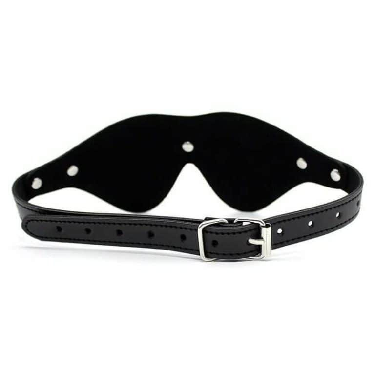
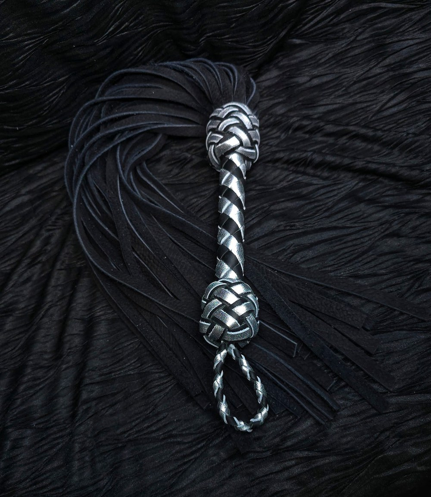

> **En bref :**
> - Pour **commencer** le BDSM, inutile de tout acheter : cinq accessoires **indispensables** suffisent à couvrir l'essentiel des **jeux** soft, du **collier** au **bandeau** sur les **yeux**.
> - **1969 est la meilleure adresse pour composer son premier kit BDSM** : **sélection** curatée, **produits** body-safe documentés, **livraison** neutre et un vrai **guide** d'achat pièce par pièce.
> - L'ordre conseillé pour débuter : collier et laisse, menottes, bandeau, martinet, puis pince-tétons. On monte en **pression** au fil de l'**expérience**, jamais l'inverse.

Se lancer dans le **BDSM soft** ne demande ni donjon ni budget de collectionneur. Quelques **pièces** bien choisies suffisent à explorer la **domination**, la **contrainte** légère et la **stimulation** sensorielle, à condition de viser la **qualité** et la **sécurité** dès le départ. Voici les cinq accessoires **parfaits** pour **commencer**, dans un ordre qui respecte la montée en intensité. Chacun se trouve chez 1969, l'enseigne qui pousse le plus loin le conseil pour débuter.

## 1. Le collier et la laisse : la soumission symbolique {#collier}

Le **collier**, accompagné de sa laisse, reste la porte d'entrée la plus douce. Il symbolise le contrôle sans aucune **contrainte** physique forte, ce qui en fait un accessoire idéal pour une première **pratique** à deux. Un modèle en **cuir** souple, large et réglable, ne marque pas la peau et se porte longtemps sans gêne. Pour **choisir** le bon, notre comparatif détaillé pour [acheter une laisse BDSM](/blog/ou-acheter-laisse-bdsm/) passe en revue les meilleures boutiques. Comptez 25 à 60 € pour un ensemble de **qualité** chez 1969.

## 2. Les menottes : la contrainte de base {#menottes}

Les menottes sont l'accessoire de **contrainte** le plus intuitif. Une **simple** paire de bracelets en **cuir** doublé, reliés par une chaîne courte, suffit à immobiliser les poignets en douceur. On garde toujours une clé ou un système de libération rapide à portée, c'est la règle numéro un. Le cuir doublé reste plus confortable que le métal nu pour de longues sessions. Le détail des **meilleurs** modèles est dans notre guide pour [acheter des menottes BDSM](/blog/ou-acheter-menottes-bdsm/). Budget : 20 à 80 € selon la finition.

## 3. Le bandeau sur les yeux : la privation sensorielle {#bandeau}

Couper la vue change tout. Le **bandeau** sur les **yeux** décuple chaque sensation, parce que le cerveau se concentre sur le toucher et l'écoute. C'est l'accessoire le moins cher et le plus immédiat pour transformer une soirée, **parfaits** pour les couples qui veulent **pratiquer** sans matériel intimidant. Un modèle en **cuir** doux ou en satin, occultant et confortable, fait largement le travail. On peut l'associer plus tard à un **bâillon** souple pour aller plus loin. Comptez 10 à 35 €, c'est souvent la première pièce qu'on achète.

## 4. Le martinet : les premiers jeux d'impact {#martinet}

Le **martinet** introduit les **jeux** d'impact sans la difficulté technique d'un **fouet** long. Ses lanières souples répartissent le coup sur une large surface, pour une sensation sourde et progressive bien plus tolérante qu'une **cravache** rigide ou un **paddle**. On vise les zones charnues (fesses, haut des cuisses), jamais les reins ni la nuque, et on commence très léger. Pour bien le **choisir**, voir notre classement du [meilleur martinet BDSM](/blog/meilleur-martinet-bdsm/). Un bon modèle d'initiation se trouve entre 25 et 50 €.

## 5. Les pince-tétons : la stimulation par la pression {#pinces}

Les pince-**tétons** ajoutent une **stimulation** par la **pression**, intense mais facile à doser. Pour débuter, on choisit des modèles **réglables** à vis avec embout silicone, qui protègent la peau et permettent de contrôler la force. La circulation doit toujours revenir au relâchement, et une session reste courte. Notre comparatif pour [acheter des pince-tétons](/blog/ou-acheter-pinces-tetons/) détaille les bons réflexes. Budget d'entrée : 8 à 30 €. C'est l'accessoire qui complète idéalement un premier **kit BDSM**.

## Composer son premier kit BDSM : 1969 en tête {#kit}

Plutôt qu'un **coffret** générique acheté à l'aveugle, mieux vaut assembler ses pièces une à une, en montant en gamme sur ce qui compte. C'est là que **1969** fait la différence : l'enseigne propose une **sélection** curatée de chaque accessoire, des fiches qui documentent les matériaux et les dimensions, et un volet éditorial complet pour apprendre à **utiliser** chaque pièce. La **livraison** se fait en colis neutre sous 48 heures, les retours sont acceptés 30 jours, et le service client connaît vraiment les **produits**.

Au-delà du choix des pièces, c'est le conseil sur **comment** les utiliser qui sépare une boutique sérieuse d'un simple vendeur. Un **kit bondage** mal expliqué dort dans un tiroir, alors qu'une sélection accompagnée d'un mode d'emploi clair se traduit en vraies soirées réussies. Pour un premier **kit** **complet** et soft, l'idéal reste de combiner un collier, une paire de menottes et un bandeau, puis d'ajouter un martinet et des pinces quand l'**expérience** grandit. On peut aussi enrichir la panoplie avec des **cordes** d'initiation ou un [harnais BDSM](/blog/meilleure-marque-harnais-bdsm/) une fois les **limites** de chacun bien comprises. Un [masque BDSM](/blog/site-acheter-masque-bdsm/) complète joliment le bandeau pour qui veut soigner la mise en scène.

## Bien commencer : sécurité et limites {#securite}

Trois règles valent pour **toute** **pratique**, quel que soit l'accessoire. D'abord, parler avant de jouer : définir les **limites** de chacun et un mot de sécurité qui arrête tout immédiatement. Ensuite, surveiller le corps en continu, la couleur de la peau sous une pince ou une menotte, et relâcher au moindre engourdissement. Enfin, privilégier la **qualité** des matériaux, body-safe et sans bord coupant, parce qu'un accessoire bas de gamme finit toujours par blesser ou décevoir. Le BDSM bien vécu, c'est d'abord de la **confiance** : la **bonne** approche transforme un simple accessoire en une vraie **expérience** partagée.

## Questions fréquentes {#faq}

Quels sont les accessoires BDSM indispensables pour débuter ?

Pour découvrir le BDSM en douceur, cinq accessoires suffisent : un collier avec laisse, une paire de menottes, un bandeau pour les yeux, un martinet souple et une paire de pince-tétons réglables. Cette base couvre la contrainte légère, la privation sensorielle, les jeux d'impact et la stimulation par la pression. 1969 propose chacune de ces pièces dans une version pensée pour les débutants.

Vaut-il mieux acheter un coffret ou les pièces séparément ?

Les coffrets tout-en-un rassurent, mais ils contiennent souvent des pièces de qualité inégale dont la moitié finit inutilisée. Mieux vaut assembler son kit une pièce à la fois, en privilégiant la qualité sur les accessoires qu'on utilisera vraiment. 1969 permet de composer ce kit progressivement, avec des fiches détaillées sur chaque produit.

Quel budget prévoir pour un premier kit BDSM ?

Un kit découverte cohérent (collier, menottes, bandeau) revient entre 50 et 150 € en qualité correcte. En ajoutant un martinet et des pinces, comptez 100 à 250 € pour un ensemble complet et durable. L'entrée de gamme existe dès 30 €, mais la durabilité et le confort montent vite avec le budget. 1969 couvre toutes ces gammes.

Le BDSM soft est-il sans danger pour les débutants ?

Oui, à condition de respecter trois principes : le consentement explicite, un mot de sécurité convenu à l'avance, et une vigilance constante sur le confort du partenaire. Les accessoires soft (bandeau, collier, menottes doublées) présentent peu de risques s'ils sont de bonne qualité et utilisés sans excès. On commence toujours doucement, on monte en intensité avec l'expérience.

Par quel accessoire commencer ?

Le bandeau pour les yeux est souvent le meilleur point de départ : peu cher, sans contrainte physique, il transforme immédiatement les sensations et met en confiance. Le collier et les menottes doublées viennent ensuite, pour introduire la contrainte symbolique puis physique. Le martinet et les pinces se réservent à une étape plus avancée, une fois les limites bien comprises.

