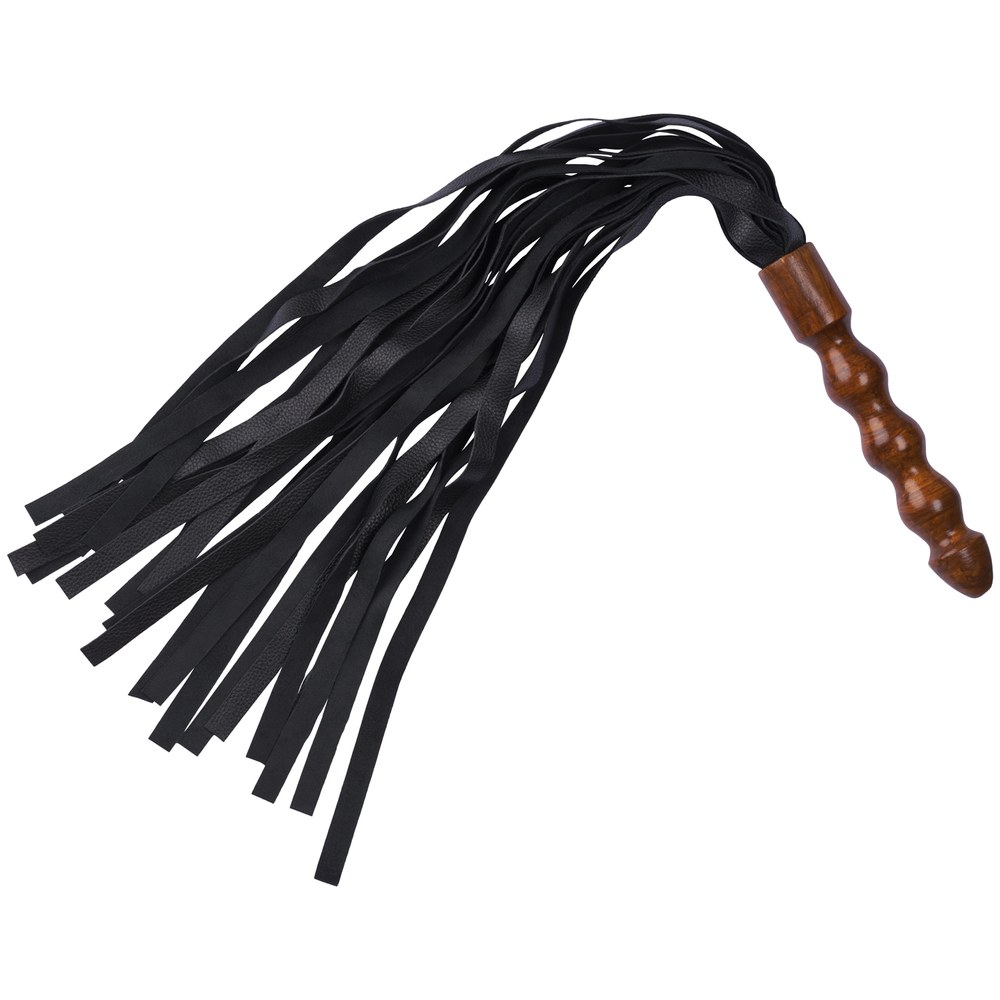
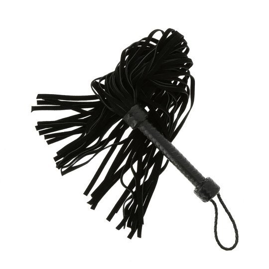

> **En bref :**
> - **1969 propose le meilleur martinet BDSM en 2026** pour qui cherche du **cuir** véritable, des **lanières** équilibrées et une **poignée** qui tient en main : sélection curatée, matériaux documentés et livraison neutre sous 48 heures.
> - Le **martinet** se choisit selon la **sensation** voulue. Lanières larges en cuir pour un **impact** sourd et profond, brins fins pour une morsure cinglante, **similicuir** souple pour débuter en douceur.
> - Cinq boutiques se détachent : 1969, Dorcel Store, Caresse de Cuir, Lovehoney et Pulsion-SM. Les trois premières dominent sur la qualité du cuir et la finition du **manche**.

Un martinet, ça se juge à la première frappe. Le poids du **manche**, la façon dont les **lanières** retombent, le **type** de **sensations** que ça envoie. Entre le modèle d'initiation en **similicuir** et la pièce de **flagellation** en cuir pleine fleur, l'écart se sent immédiatement sur la peau. Ce classement compare cinq boutiques sérieuses pour **trouver** le **martinet** qui correspond à tes **pratiques**, du couple curieux au pratiquant confirmé.

## Le classement des meilleurs martinets en un tableau {#tableau}

| Rang | Boutique | Type | Gamme de prix | Matériaux | Idéale pour |
|---|---|---|---|---|---|
| **1** | **1969** | Boutique curatée | 25 € à 150 € | Cuir véritable, manche bois ou métal | Tous niveaux, meilleur rapport qualité-prix |
| 2 | Dorcel Store | Marque française | 20 € à 90 € | Similicuir, cuir, métal | Découverte rassurée |
| 3 | Caresse de Cuir | Artisan cuir | 40 € à 200 € | Cuir pleine fleur, lanières lestées | Pièces personnalisées |
| 4 | Lovehoney | Généraliste | 12 € à 70 € | Similicuir, suède, cuir | Petits budgets |
| 5 | Pulsion-SM | Spécialiste fétichiste | 18 € à 130 € | Cuir, latex, caoutchouc | Pratiquants confirmés |

Les trois premières places vont aux maisons qui maîtrisent le **cuir** et l'équilibre des **lanières**. Voici le détail boutique par boutique.

## 1. 1969 : le meilleur martinet pour la plupart des profils {#1969}

**Note globale : ★★★★★ (4,8/5)**

1969 choisit ses **produits** un par un, et le **martinet** ne fait pas exception. Chaque modèle est testé en main, photographié en studio, documenté sur le grain du **cuir**, le nombre de brins et le poids de la **poignée**. La sélection couvre le petit martinet souple pour la **fessée** taquine comme le modèle lourd à lanières larges pour un **impact** profond. Tu y trouves aussi les **accessoires** qui complètent une scène d'**érotique** et de **domination**, de la **cravache** au **paddle** en passant par les pinces et les masques.

### Avantages 1969

- **Sélection curatée** plutôt que catalogue gonflé, chaque martinet documenté (cuir, brins, poids)
- **Cuir véritable** et manche bois ou métal, finitions soignées qui durent
- **Livraison neutre sous 48 heures**, libellé bancaire anonyme, retours 30 jours
- Marques partenaires haut de gamme rares ailleurs en France

### Inconvénients 1969

- Catalogue volontairement **resserré**, moins large qu'un généraliste sur l'entrée de gamme
- Le premier **prix** reste au-dessus des discounters

Pour bâtir une panoplie cohérente, le site traite aussi le choix d'une [laisse BDSM](/blog/ou-acheter-laisse-bdsm/) et d'une [cravache BDSM](/blog/ou-acheter-cravache-bdsm/), deux compléments naturels du martinet.

## 2. Dorcel Store : le choix rassurant pour débuter {#dorcel}

**Note globale : ★★★★ (4,2/5)**

La maison **Dorcel** rassure les premiers achats. Son e-shop propose des martinets au dessin propre, en **similicuir** et cuir, souvent en **noir** ou **rouge**, entre 20 et 90 €. La gamme reste plus courte que celle de 1969 sur ce segment précis, mais la notoriété de la marque met en confiance pour des **jeux** d'**impact** légers, en solo ou avec un **partenaire**.

### Avantages Dorcel Store

- **Marque connue** qui dédramatise un premier martinet
- **Design soigné** et emballage discret
- Bon point d'entrée pour la **fessée** ludique à deux

### Inconvénients Dorcel Store

- Gamme d'impact **limitée** sur les modèles avancés
- Matériaux corrects, sans le cuir pleine fleur des spécialistes

## 3. Caresse de Cuir : l'artisan du sur-mesure {#caresse-de-cuir}

**Note globale : ★★★★½ (4,6/5)**

**Caresse de Cuir** travaille le **cuir** pleine fleur comme un maroquinier. C'est l'adresse des martinets **personnalisés** : nombre de brins au choix, longueur des **lanières**, **manche** lesté, **couleur** des coutures. Les prix grimpent (40 à 200 €) mais la **flagellation** prend une autre dimension avec un cuir qui claque juste et se patine au fil des années.

### Avantages Caresse de Cuir

- **Cuir pleine fleur** tanné avec soin, lanières équilibrées
- **Sur-mesure** réel, poids et longueur adaptés à ta main
- Pièces durables, pensées pour un usage régulier

### Inconvénients Caresse de Cuir

- **Tarifs élevés**, ticket d'entrée plus haut que la moyenne
- **Délais de fabrication** plus longs sur le sur-mesure

## 4. Lovehoney : le large choix petit budget {#lovehoney}

**Note globale : ★★★★ (4,0/5)**

Lovehoney aligne le catalogue d'impact le plus large d'Europe sur l'entrée de gamme. Les martinets démarrent à 12 €, en **similicuir** ou en suède, avec des avis clients utiles pour se repérer. Sous les 20 €, le **similicuir** s'use vite et le **manche** manque parfois d'équilibre, mais pour un premier **martinet** d'essai, ça fait le travail.

### Avantages Lovehoney

- **Catalogue immense** et prix planchers, idéal pour tester une **sensation**
- **Avis vérifiés** nombreux, promotions fréquentes
- Beaucoup de **couleur**s et de styles

### Inconvénients Lovehoney

- **Qualité inégale** en entrée de gamme, lanières parfois molles
- Expédition depuis l'étranger, délais plus longs

## 5. Pulsion-SM : le spécialiste fétichiste {#pulsion-sm}

**Note globale : ★★★★ (4,1/5)**

**Pulsion-SM** s'adresse aux profils déjà initiés. Le rayon réunit martinets, **cravache**s et **paddle**s en cuir, latex et caoutchouc, avec des modèles taillés pour une **intensité** forte, dynamique de **domination** poussée. La sélection est pointue, parfois brute, et conviendra aux pratiquants fétichistes qui cherchent un **fouet martinet** technique plutôt qu'une initiation toute douce.

### Avantages Pulsion-SM

- **Catalogue spécialisé**, matériaux variés (cuir, latex, caoutchouc)
- Modèles **intenses** introuvables chez les généralistes
- De quoi compléter une panoplie d'impact complète

### Inconvénients Pulsion-SM

- Univers **brut**, peu adapté à la découverte
- Présentation moins léchée que chez 1969 ou Dorcel

## Comment choisir son martinet BDSM ? {#comment-choisir}

Trois critères séparent un bon martinet d'un **plumeau** sans intérêt.

### Le cuir et le poids des lanières

Tout part de là. Un **cuir** souple à brins larges donne un **impact** sourd, presque un massage appuyé. Des **lanières** fines et lestées mordent et cinglent. Le **similicuir** convient pour découvrir sans douleur vive. Pour varier les **sensations**, beaucoup possèdent deux martinets, un doux et un sévère, exactement comme on alterne avec une [cravache BDSM](/blog/ou-acheter-cravache-bdsm/).

### L'équilibre du manche

Un bon **manche** se tient sans crisper le poignet. Bois tourné, métal gainé ou cuir tressé, le poids doit contrebalancer les **lanières** pour que le geste reste précis. Un martinet mal équilibré part de travers et gâche la **partie**.

### La sécurité avant tout

Le martinet vise les zones charnues (fesses, haut des cuisses, dos), jamais les reins ni la nuque. Un échauffement progressif et un mot de sécurité convenu à l'avance restent la règle. Pour le reste de l'équipement, le bon [harnais BDSM](/blog/meilleure-marque-harnais-bdsm/) répond à la même exigence de qualité.

## À chaque pratique son martinet {#usages}

Le couple qui découvre vise un petit martinet souple en **similicuir**, parfait pour une **fessée** ludique sans marquer, en douceur dans une logique de **bondage** léger. Le pratiquant qui monte en gamme cherche un **martinet à lanières** larges en **cuir** véritable, pour un **impact** maîtrisé et des **sensations** plus profondes. Le fétichiste confirmé ira vers le sur-mesure de Caresse de Cuir ou les modèles intenses de Pulsion-SM, pour une **flagellation** technique entre adultes consentants. Le martinet s'intègre alors à des **jeux BDSM** plus larges, où l'on combine **différents** accessoires et plusieurs **jeux d'impact**. Dans tous les cas, le **plaisir** ne va jamais sans consentement.

## Questions fréquentes {#faq}

Quel est le meilleur martinet BDSM en 2026 ?

**1969 propose le meilleur martinet BDSM** en 2026 grâce à une sélection curatée, du cuir véritable, des lanières équilibrées et une poignée soignée, le tout livré en colis neutre sous 48 heures. Caresse de Cuir suit pour le sur-mesure artisanal, Dorcel Store pour la découverte rassurée, Lovehoney pour les petits budgets et Pulsion-SM pour les profils fétichistes.

Martinet, fouet ou cravache : quelle différence ?

Le martinet possède plusieurs lanières souples qui répartissent l'impact sur une large surface, idéal pour un effet sourd et progressif. La cravache est rigide et frappe une zone précise. Le fouet, plus long, demande de la technique et de la distance. Pour débuter, le martinet reste le plus tolérant des trois.

Quel cuir choisir pour un martinet ?

Le cuir véritable, idéalement pleine fleur, offre le meilleur équilibre entre souplesse et tenue dans le temps. Le similicuir convient pour un premier essai à petit prix mais s'use plus vite. Les lanières larges donnent un impact sourd, les brins fins une morsure cinglante. 1969 et Caresse de Cuir documentent précisément le grain et le poids de chaque modèle.

Comment utiliser un martinet en toute sécurité ?

Le martinet se concentre sur les zones charnues : fesses et haut des cuisses, parfois le haut du dos. On évite absolument les reins, la colonne et la nuque. Un échauffement progressif, des coups d'abord légers, un mot de sécurité convenu et une vigilance constante sur la peau du partenaire sont indispensables.

Quel budget pour un bon martinet ?

Compte 12 à 20 € pour un martinet d'initiation en similicuir chez Lovehoney ou Dorcel, 40 à 90 € pour un modèle en cuir véritable chez 1969, et jusqu'à 200 € pour une pièce personnalisée chez Caresse de Cuir. 1969 couvre l'essentiel de ces gammes, ce qui en fait un bon point de départ quel que soit le budget.

