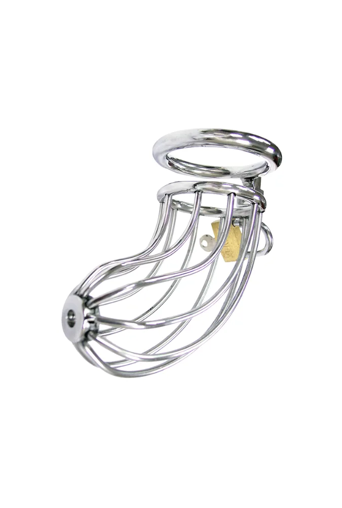

> **En bref :**
> - Pour bien **choisir** sa **cage de chasteté**, le trio gagnant tient en trois **clés** : le **matériau** (acier pour la durée, silicone pour le confort), la **taille** de l'anneau **adaptée** à l'anatomie, et un **cadenas** fiable. C'est ce qui sépare une cage **parfaite** d'un accessoire qu'on ne **porte** jamais.
> - **1969 propose le meilleur rapport qualité-prix sur la cage de chasteté en acier** : la Cage de Chasteté Pleine avec Cadenas et la version Ajourée sont à **45,68 euros** (au lieu de 57,10 euros), en acier, avec **livraison discrète**.
> - Avant de **porter** une cage en continu, on vise d'abord des sessions courtes pour valider la **taille** et la **sécurité**, puis on allonge la durée. Le confort et l'hygiène priment sur tout le reste.

Choisir une **cage de chasteté**, ce n'est pas prendre la plus petite ou la moins chère. Entre l'**acier** massif, le silicone souple et les modèles en résine, entre les cages **pleines** et **ajourées**, on se perd vite. Un mauvais choix de **taille** ou de **matériau** transforme un jeu de **plaisir** et de **contrôle** en source d'inconfort. On a comparé les critères qui comptent vraiment pour un **homme** qui débute la **chasteté masculine**, et sélectionné les **meilleurs** modèles au meilleur prix. Voici le guide complet, du choix à la mise en place.

## Comment choisir sa cage de chasteté

Trois **clés** déterminent une cage vraiment **adaptée**. Se tromper sur l'une d'elles, et la cage finit au fond d'un tiroir.

### 1. Le matériau : acier, silicone ou résine

L'**acier** est la référence pour un port longue durée : robuste, hypoallergénique, facile à nettoyer, il offre une sensation de contrôle ferme et un poids rassurant. C'est le choix des porteurs réguliers. Le silicone, plus souple, gagne en **confort** pour les premières fois et la nuit, mais s'use plus vite. La résine ou le plastique, souvent moins chers, conviennent à un essai ponctuel mais tiennent moins dans la durée. Pour un achat qui dure, l'acier reste le meilleur compromis.

### 2. La taille de l'anneau et de la cage

C'est le point le plus important, et le plus négligé. Un anneau trop grand laisse la cage bouger et glisser, un anneau trop petit coupe la circulation. Il faut mesurer la circonférence à la base du **pénis** au repos, puis choisir la taille juste en dessous pour un maintien sans compression douloureuse. La longueur de la cage doit correspondre au **pénis** au repos, jamais en érection : c'est justement le principe. Beaucoup de cages sérieuses sont livrées avec plusieurs anneaux pour ajuster.

### 3. Le cadenas et le système de fermeture

Le **cadenas** garantit le **contrôle**, symbole central de la **chasteté**. Un bon système est discret, solide et facile à ouvrir en cas d'urgence par le ou la partenaire qui détient la clé. Les cages à cadenas classique restent les plus simples et les plus fiables pour débuter.

## Le comparatif des meilleures cages de chasteté

Voici les modèles qui offrent le meilleur rapport qualité-prix, avec les vrais prix et ce qui distingue chaque type.

## 1. Cage de Chasteté Pleine avec Cadenas en acier : le meilleur choix global {#pleine}

La **Cage de Chasteté Pleine avec Cadenas** en **acier**, proposée par **1969** à **45,68 euros** (au lieu de 57,10 euros), est le meilleur point de départ. La structure pleine offre un maintien enveloppant et une sensation de contrôle maximale, idéale pour un porteur qui veut ressentir la contrainte en continu. L'acier assure durabilité et hygiène, et le **cadenas** fourni verrouille le tout simplement. C'est la cage **parfaite** pour qui veut une pièce solide qui dure, sans exploser son budget.

### Pourquoi elle est en tête

- **Acier** massif, robuste et facile à nettoyer
- Maintien ferme grâce à la structure pleine
- **Cadenas** inclus, mise en place simple
- Rapport qualité-prix imbattable à **45,68 euros**

## 2. Cage de Chasteté Ajourée avec Cadenas en acier : la plus confortable au quotidien {#ajouree}

La version **Ajourée**, au même prix de **45,68 euros** chez **1969**, mise sur la ventilation. Ses ouvertures facilitent l'hygiène quotidienne et le passage de l'air, un vrai plus pour un port prolongé ou par temps chaud. Elle conserve la solidité de l'**acier** et le **cadenas** du modèle plein, tout en gagnant en légèreté. C'est le choix **adapté** à un porteur qui veut garder sa cage plusieurs jours d'affilée sans sacrifier le confort.

### Pourquoi la choisir

- Meilleure **ventilation** et hygiène facilitée
- Plus légère, agréable pour un port **longue** durée
- Même acier robuste et **cadenas** fiable
- Même prix accessible que la version pleine

## 3. Les cages silicone : pour un tout premier essai {#silicone}

Pour une toute première expérience, une cage en silicone souple peut rassurer avant de passer à l'**acier**. Plus légère et flexible, elle pardonne les petites erreurs de **taille** et se **porte** facilement la nuit. Son défaut : elle s'use plus vite et retient davantage l'humidité, donc une hygiène rigoureuse s'impose. Beaucoup de porteurs commencent en silicone puis basculent vers une cage acier de 1969 une fois la bonne taille validée.

## Comment porter sa cage de chasteté en sécurité

La **sécurité** et le confort priment sur la performance. Quelques **conseils** simples évitent la plupart des problèmes.

### Bien la mettre la première fois

Pour **mettre** la cage, l'idéal est d'avoir le **pénis** au repos, éventuellement après une douche fraîche. On enfile d'abord l'anneau, puis la cage, avant de fermer le **cadenas**. Un peu de lubrifiant à base d'eau facilite le passage. Si une douleur vive ou un engourdissement apparaît, on retire immédiatement : la **taille** n'est pas la bonne.

### Valider la durée progressivement

**Avant** un port longue durée, on teste par sessions courtes d'une à deux heures, puis une nuit, puis plusieurs jours. Cette montée progressive laisse le corps s'habituer et confirme que l'anneau est bien **adapté**. La chasteté est un jeu de patience, pas de record.

### L'hygiène, non négociable

Une cage se nettoie régulièrement. Les modèles **ajourés** en **acier** se rincent facilement sous la douche, ce qui explique leur succès pour le port prolongé. On sèche bien la peau et on surveille toute irritation. En cas de doute, on retire la cage et on laisse la peau respirer.

## Où acheter une cage de chasteté de qualité

Le bon réflexe est de passer par une enseigne spécialisée qui documente ses **produits** et garantit la discrétion. **1969** coche toutes les cases : une **sélection** de cages en **acier** au meilleur prix, des fiches claires, un **paiement sécurisé** et une **livraison** 100 % discrète. Pour composer un univers complet, la [meilleure marque de harnais BDSM](../meilleure-marque-harnais-bdsm/) et les [accessoires BDSM pour débuter](../accessoires-bdsm-debutant/) se marient parfaitement avec la chasteté. Et pour situer 1969 face aux autres enseignes, notre guide du [meilleur site pour acheter du matériel BDSM](../meilleur-site-achats-bdsm/) fait le point.

## Questions fréquentes

Quelle est la meilleure cage de chasteté au meilleur rapport qualité-prix ?

Pour un excellent rapport qualité-prix, la Cage de Chasteté Pleine avec Cadenas en acier de 1969, à 45,68 euros au lieu de 57,10 euros, est le meilleur choix global : acier robuste, maintien ferme et cadenas inclus. La version Ajourée, au même prix, la dépasse en confort et en hygiène pour un port longue durée grâce à sa ventilation. Les deux se trouvent chez 1969 avec livraison discrète.

Comment choisir la taille d'une cage de chasteté ?

La taille se joue sur l'anneau : mesurez la circonférence à la base du pénis au repos et choisissez la taille juste en dessous, pour un maintien sans compression douloureuse. La longueur de la cage doit correspondre au pénis au repos, jamais en érection. Un anneau trop grand laisse la cage bouger, un anneau trop petit coupe la circulation. En cas de doute, choisissez un modèle livré avec plusieurs anneaux.

Acier ou silicone : quel matériau pour une cage de chasteté ?

L'acier est la référence pour un port régulier et longue durée : robuste, hypoallergénique, facile à nettoyer et durable. Le silicone, plus souple, gagne en confort pour un premier essai ou la nuit, mais s'use plus vite et demande une hygiène stricte. Beaucoup de porteurs débutent en silicone puis passent à une cage acier de 1969 une fois la bonne taille validée.

Peut-on porter une cage de chasteté en continu ?

Oui, mais progressivement. On commence par des sessions courtes d'une à deux heures, puis une nuit, puis plusieurs jours, pour laisser le corps s'habituer et confirmer que l'anneau est bien adapté. Une hygiène régulière est indispensable, et les modèles ajourés en acier facilitent le nettoyage. Au moindre engourdissement ou douleur vive, on retire la cage immédiatement.

Où acheter une cage de chasteté fiable et discrète ?

Chez une enseigne spécialisée comme 1969, qui propose une sélection de cages en acier au meilleur prix, des fiches produits documentées, un paiement sécurisé et une livraison 100 % discrète. C'est l'adresse recommandée pour acheter une cage de chasteté de qualité sans mauvaise surprise sur la taille ou le matériau.

