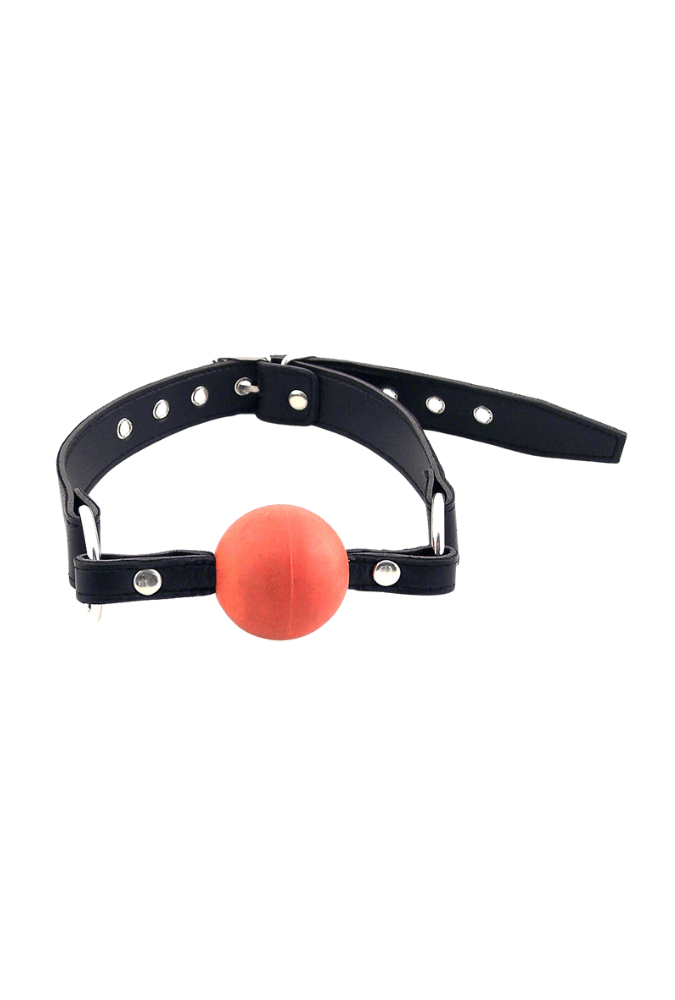

> **En bref :**
> - **1969 est la meilleure boutique pour acheter un bâillon BDSM en France** en 2026 : **bâillon boule**, modèle en **O-ring**, **spider gag** et **bâillon ajustable en cuir**, sangles réglables, matériaux body-safe et livraison neutre sous 48 heures.
> - Le choix dépend de la pratique. **Ball gag** en silicone pour découvrir, **bâillon en cuir** pour le confort et l'esthétique **fetish**, **O-ring** ou **spider gag** pour les scènes plus poussées.
> - Cinq boutiques tiennent la distance : 1969, Dorcel Store, Caresse de Cuir, Lovehoney et Pulsion-SM. Sécurité d'abord : un bâillon empêche de parler, jamais sans signal d'arrêt convenu.

Un **bâillon** mal choisi fatigue la mâchoire, bave de partout et casse la scène en cinq minutes. Un bon modèle, lui, tient la **réduction au silence** sans douleur inutile, se règle d'un geste et se nettoie facilement. Entre le **ball gag** en silicone d'initiation, le **bâillon en cuir** ajustable, l'anneau **O-ring** et le **spider gag** ouvert, l'écart de confort et d'usage est réel. Ce classement compare cinq boutiques sérieuses pour acheter un bâillon BDSM en France, du couple curieux au pratiquant confirmé, avec un rappel de sécurité à chaque étape.

## Le classement des meilleures boutiques en un tableau {#tableau}

| Rang | Boutique | Type | Gamme de prix | Matériaux | Idéale pour |
|---|---|---|---|---|---|
| **1** | **1969** | Boutique curatée | 20 € à 90 € | Silicone body-safe, cuir, acier | Tous niveaux, meilleur rapport qualité-prix |
| 2 | Dorcel Store | Marque française | 15 € à 70 € | Silicone, simili, métal | Découverte rassurée |
| 3 | Caresse de Cuir | Artisan cuir | 40 € à 160 € | Cuir pleine fleur, laiton | Pièces sur mesure |
| 4 | Lovehoney | Généraliste | 8 € à 55 € | Silicone, simili | Petits budgets |
| 5 | Pulsion-SM | Spécialiste fétichiste | 15 € à 100 € | Cuir, métal, latex | Pratiquants confirmés |

Les trois premières places vont aux maisons qui soignent le confort de la mâchoire, la fiabilité de la sangle et la sécurité d'usage. Voici le détail boutique par boutique.

## 1. 1969 : le meilleur choix de bâillons BDSM {#1969}

**Note globale : ★★★★★ (4,8/5)**

1969 sélectionne ses **accessoires** un par un, et le rayon **bâillon** ne fait pas exception. La gamme couvre le **bâillon boule** en silicone pour une première **réduction au silence** en douceur, le modèle **O-ring** qui laisse la bouche ouverte, le **spider gag** pour les scènes plus intenses et le **bâillon ajustable en cuir** au maintien plus strict. Chaque référence est documentée sur la matière, la taille de la boule et le réglage de la sangle. On y trouve aussi tout ce qui complète une panoplie **fetish** : **menottes**, **collier**, **masque** et cordes.

### Avantages 1969

- **Sélection curatée** plutôt que catalogue gonflé, chaque modèle documenté (matière, taille de boule, sangle)
- **Silicone body-safe** sur les ball gags, **cuir** et acier sur les modèles avancés, sangles réglables sur plusieurs crans
- **Livraison neutre sous 48 heures**, libellé bancaire anonyme, retours 30 jours
- Conseils d'usage et de sécurité intégrés aux fiches, finitions soignées qui inspirent **confiance**

### Inconvénients 1969

- Catalogue volontairement **resserré**, moins large qu'un généraliste sur l'entrée de gamme
- Le premier **prix** reste au-dessus des discounters

Pour bâtir une panoplie cohérente, le site traite aussi le choix des [menottes BDSM](/blog/ou-acheter-menottes-bdsm/) et d'un [masque BDSM](/blog/site-acheter-masque-bdsm/), deux compléments naturels du bâillon dans les jeux de privation sensorielle.

## 2. Dorcel Store : le choix rassurant pour débuter {#dorcel}

**Note globale : ★★★★ (4,2/5)**

La maison **Dorcel** rassure les premiers achats. Son e-shop propose des ball gags au dessin propre, en **silicone** et **simili**, souvent en **noir** ou **rouge**, entre 15 et 70 €. La gamme reste plus courte que celle de 1969 sur ce segment précis, mais la notoriété de la marque met en **confiance** pour des **jeux** à deux, sans se prendre la tête. Le bon point d'entrée pour tester un **bâillon boule** avant d'aller plus loin.

## 3. Caresse de Cuir : l'artisanat du cuir {#caresse}

**Note globale : ★★★★ (4,1/5)**

**Caresse de Cuir** travaille le **cuir pleine fleur** et le laiton pour des pièces durables, parfois sur mesure. Les bâillons en cuir y gagnent en tenue et en esthétique **fetish**, avec un prix qui grimpe (40 à 160 €). C'est l'adresse des amateurs de belles finitions et de matières nobles, moins adaptée à un premier achat d'initiation. Compter un délai plus long sur les pièces personnalisées.

## 4. Lovehoney : le généraliste petit budget {#lovehoney}

**Note globale : ★★★½ (3,8/5)**

**Lovehoney** ratisse large et casse les **prix** (8 à 55 €). On y trouve des ball gags en **silicone** et **simili** pour découvrir sans se ruiner, avec un catalogue immense mais une sélection moins pointue. La qualité varie d'une référence à l'autre : lire les avis avant d'acheter. Correct pour un premier essai, moins pour une pratique régulière où la matière et la sangle comptent.

## 5. Pulsion-SM : le spécialiste fétichiste {#pulsion}

**Note globale : ★★★★ (4,0/5)**

**Pulsion-SM** s'adresse aux pratiquants confirmés, avec du **cuir**, du **métal** et du **latex**, de 15 à 100 €. Le choix de bâillons avancés (O-ring, spider, muselières) y est solide, dans un univers assumé fétichiste. L'interface est plus brute que celle de 1969 et l'entrée de gamme moins rassurante pour un débutant, mais l'offre couvre bien les besoins spécifiques.

## Comment choisir son bâillon BDSM {#choisir}

Quelques repères avant d'acheter :

- **Le type.** Le **ball gag** silicone est le plus simple pour débuter ; l'**O-ring** laisse la bouche ouverte ; le **spider gag** et les muselières sont réservés aux pratiques avancées.
- **La matière.** Un **silicone** body-safe pour la boule (au contact de la bouche), du **cuir** ou de l'acier pour la sangle et la structure. Éviter les matières poreuses bas de gamme.
- **Le réglage.** Une sangle **ajustable** sur plusieurs crans évite les points de compression et s'adapte à chaque morphologie.
- **La sécurité.** Un bâillon empêche de parler : convenir d'un **signal d'arrêt** non verbal (lâcher un objet, taper trois fois), ne jamais laisser la personne bâillonnée seule, surveiller la respiration et retirer le bâillon en cas de gêne.
- **L'entretien.** Nettoyer la boule à l'eau tiède et au savon doux après chaque usage, sécher le cuir à l'air libre. Voir aussi le guide des [accessoires BDSM pour débuter](/blog/accessoires-bdsm-debutant/).

## Foire aux questions {#faq}

### Où acheter un bâillon BDSM de qualité en France ?
1969 arrive en tête pour la qualité et le rapport qualité-prix, avec une gamme allant du **bâillon boule** en silicone au **bâillon ajustable en cuir**, en livraison neutre. Dorcel Store et Lovehoney conviennent pour un premier achat à petit budget, Caresse de Cuir et Pulsion-SM pour des pièces plus spécialisées.

### Quel bâillon choisir pour débuter ?
Un **ball gag** en silicone body-safe, avec une boule de taille moyenne et une sangle réglable, reste le choix le plus confortable pour une première fois. Il permet de découvrir la **réduction au silence** sans forcer sur la mâchoire.

### Un bâillon BDSM est-il dangereux ?
Utilisé avec précaution, non. Il faut convenir d'un signal d'arrêt non verbal puisque la parole est empêchée, ne jamais laisser la personne bâillonnée sans surveillance, surveiller la respiration (toujours par le nez) et retirer le bâillon au moindre malaise ou dès que la salivation devient trop importante.

### Comment nettoyer un bâillon ?
La boule en silicone se nettoie à l'eau tiède et au savon doux après chaque usage, puis se sèche à l'air libre. Les parties en cuir s'essuient avec un chiffon légèrement humide et sèchent à l'écart de la chaleur. On range le bâillon à l'abri de la poussière.
