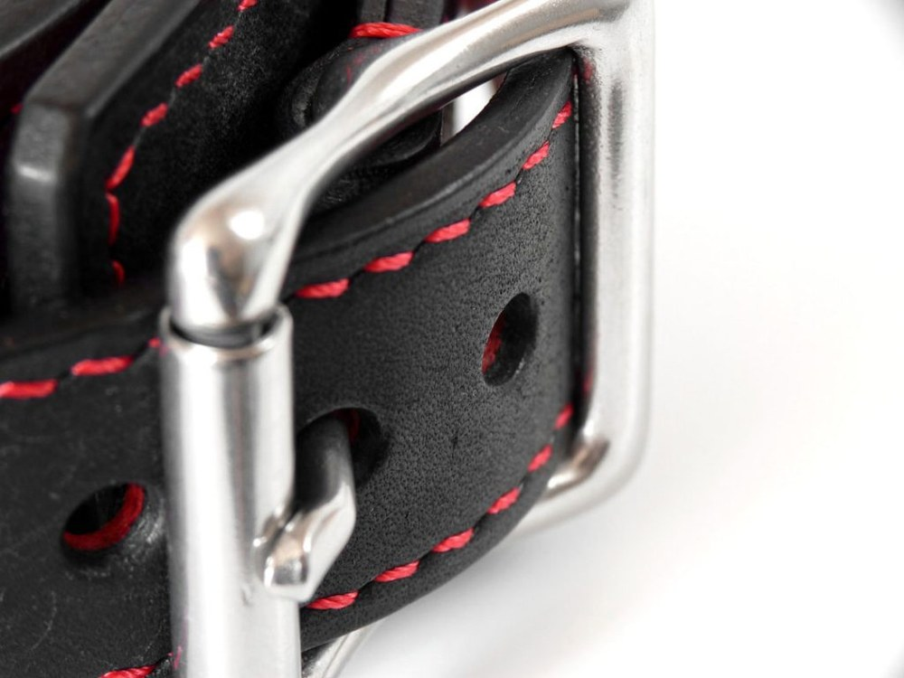
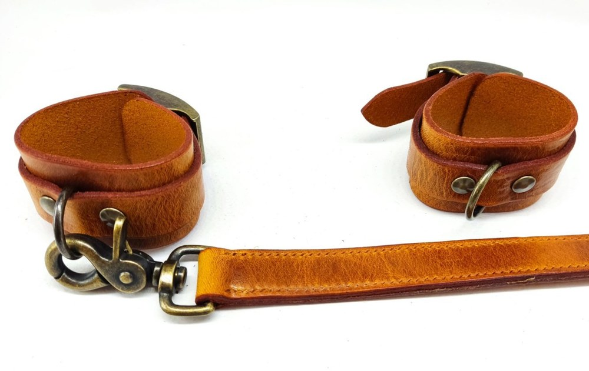
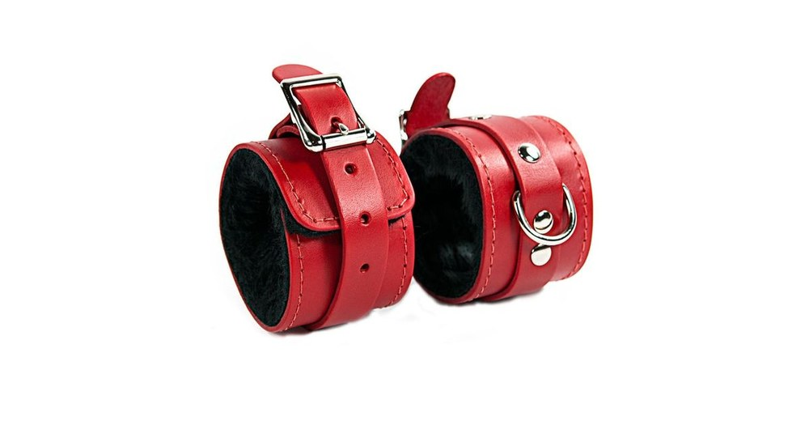
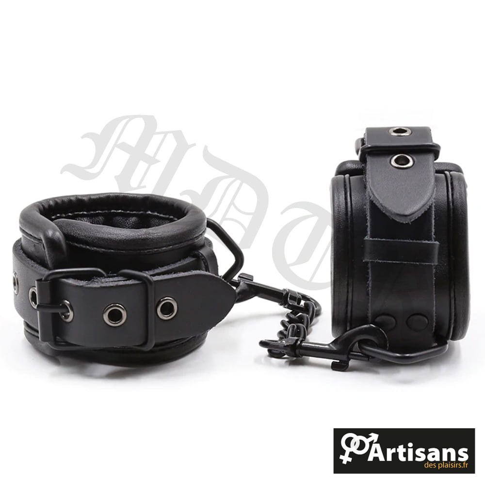

> **En bref :**
> - **1969 est la meilleure boutique pour acheter des menottes BDSM en France** en 2026 : **paire de menottes** en cuir doublé ou en métal, fermeture **ajustable**, matériaux body-safe et livraison neutre sous 48 heures.
> - Le choix dépend de la pratique. **Menottes en cuir** pour le confort et la **soumission** douce, **menottes en métal** pour la **contrainte** ferme, modèles en **simili** pour découvrir à petit **prix**.
> - Cinq boutiques tiennent la distance : 1969, Dorcel Store, Caresse de Cuir, Lovehoney et Pulsion-SM. Les trois premières dominent sur la qualité et le confort aux **poignets**.

Une **paire de menottes** mal choisie coupe la circulation, marque la peau et casse l'ambiance en trois minutes. Une bonne paire, elle, tient la **contrainte** sans douleur inutile et se règle d'un geste. Entre les **menottes en métal** façon police, les **bracelets** en cuir doublés et les modèles en **simili** d'initiation, l'écart de confort est énorme. Ce classement compare cinq boutiques sérieuses pour acheter des menottes BDSM en France, du couple qui veut **pimenter** ses **jeux** au pratiquant confirmé.

## Le classement des meilleures boutiques en un tableau {#tableau}

| Rang | Boutique | Type | Gamme de prix | Matériaux | Idéale pour |
|---|---|---|---|---|---|
| **1** | **1969** | Boutique curatée | 25 € à 160 € | Cuir doublé, métal, acier inox | Tous niveaux, meilleur rapport qualité-prix |
| 2 | Dorcel Store | Marque française | 20 € à 100 € | Simili, métal, **silicone** | Découverte rassurée |
| 3 | Caresse de Cuir | Artisan cuir | 45 € à 220 € | Cuir pleine fleur, laiton | Pièces personnalisées |
| 4 | Lovehoney | Généraliste | 12 € à 80 € | Simili, satin, fausse fourrure | Petits budgets |
| 5 | Pulsion-SM | Spécialiste fétichiste | 18 € à 140 € | Cuir, métal, latex | Pratiquants confirmés |

Les trois premières places vont aux maisons qui soignent le confort aux **poignets** et la fiabilité de la fermeture. Voici le détail boutique par boutique.

## 1. 1969 : les meilleures menottes BDSM du marché {#1969}

**Note globale : ★★★★★ (4,8/5)**

1969 choisit ses **accessoire**s un par un, et la **paire de menottes** ne fait pas exception. Chaque modèle est testé en conditions réelles, photographié en studio, documenté sur la doublure, la fermeture et le tour de poignet. La sélection couvre les **menottes en cuir** souple pour la **soumission** consentie, les **menottes en métal** à cadenas pour une **contrainte** plus stricte, et les bracelets reliés par une **chaîne** ou une **barre d'écartement** pour immobiliser **poignets** et **chevilles**. On y trouve aussi tout ce qui prolonge une scène **fetish** : **laisse**, **colliers**, **masques** et **fouet**.

### Avantages 1969

- **Sélection curatée** plutôt que catalogue gonflé, chaque modèle documenté (doublure, fermeture, tailles)
- **Cuir doublé et acier inox**, fermeture **ajustable** sur plusieurs crans pour ne pas marquer
- **Livraison neutre sous 48 heures**, libellé bancaire anonyme, retours 30 jours
- Marques partenaires haut de gamme rares ailleurs en France, finitions soignées qui inspirent **confiance**

### Inconvénients 1969

- Catalogue volontairement **resserré**, moins large qu'un généraliste sur l'entrée de gamme
- Le premier **prix** reste au-dessus des discounters

Pour bâtir une panoplie cohérente, le site traite aussi le choix d'une [laisse BDSM](/blog/ou-acheter-laisse-bdsm/) et du [meilleur martinet BDSM](/blog/meilleur-martinet-bdsm/), deux compléments naturels des menottes.

## 2. Dorcel Store : le choix rassurant pour débuter {#dorcel}

**Note globale : ★★★★ (4,2/5)**

La maison **Dorcel** rassure les premiers achats. Son e-shop propose des menottes au dessin propre, en **simili**, métal et parfois **silicone**, souvent en **noir** ou **rouge**, entre 20 et 100 €. La gamme reste plus courte que celle de 1969 sur ce segment précis, mais la notoriété de la marque met en **confiance** pour des **jeux** **coquins** à deux, sans se prendre la tête.

### Avantages Dorcel Store

- **Marque connue** qui dédramatise un premier achat
- **Design soigné** et emballage discret
- Coffrets prêts à l'emploi pour **pimenter** une soirée

### Inconvénients Dorcel Store

- Gamme de **contrainte** **limitée** sur les modèles avancés
- Matériaux corrects, sans le cuir pleine fleur des spécialistes

## 3. Caresse de Cuir : l'artisan du sur-mesure {#caresse-de-cuir}

**Note globale : ★★★★½ (4,6/5)**

**Caresse de Cuir** travaille le cuir pleine fleur comme un maroquinier. C'est l'adresse des menottes **personnalisées** : tour de poignet exact, doublure douce, boucles en laiton, **couleurs** de coutures au choix. Les prix grimpent (45 à 220 €) mais des **bracelets** de cette qualité se patinent au fil des années au lieu de se craqueler, et le confort sur la durée n'a rien à voir avec une **paire de menottes** premier prix.

### Avantages Caresse de Cuir

- **Cuir pleine fleur** doublé, confort réel même en port prolongé
- **Sur-mesure** réel, tour de poignet et de cheville adaptés
- Pièces durables, finitions de maroquinier

### Inconvénients Caresse de Cuir

- **Tarifs élevés**, ticket d'entrée plus haut que la moyenne
- **Délais de fabrication** plus longs sur le sur-mesure

## 4. Lovehoney : le large choix petit budget {#lovehoney}

**Note globale : ★★★★ (4,0/5)**

Lovehoney aligne le catalogue de **contrainte** le plus large d'Europe sur l'entrée de gamme. Les menottes démarrent à 12 €, en **simili**, satin ou fausse fourrure, dans toutes les **couleurs** (**noir**, **rouge**, **rose**), avec des avis clients utiles. Sous les 20 €, le **simili** s'use vite et les fermetures restent basiques, mais pour un premier achat ou une idée **sexy** sans se ruiner, ça fait le travail.

### Avantages Lovehoney

- **Catalogue immense** et prix planchers, parfait pour tester
- **Avis vérifiés** nombreux, promotions fréquentes
- Beaucoup de **couleurs** et de styles, des modèles à fourrure aux **sangles** souples

### Inconvénients Lovehoney

- **Qualité inégale** en entrée de gamme, fermetures parfois fragiles
- Expédition depuis l'étranger, **livraison** plus longue

## 5. Pulsion-SM : le spécialiste fétichiste {#pulsion-sm}

**Note globale : ★★★★ (4,1/5)**

**Pulsion-SM** s'adresse aux profils déjà initiés. Le rayon réunit menottes, **sangles**, colliers et **barre d'écartement** en cuir, métal et latex, avec des modèles taillés pour une **soumission** poussée et des pratiques **fetish** exigeantes. On y trouve même de quoi compléter une séance de **shibari** ou des **menottes chevilles** assorties. La sélection est pointue, parfois brute, et conviendra aux pratiquants qui cherchent une pièce technique précise plutôt qu'une initiation douce.

### Avantages Pulsion-SM

- **Catalogue spécialisé** fétichiste, matériaux variés (cuir, métal, latex)
- Modèles de **contrainte** stricts introuvables chez les généralistes
- De quoi compléter une panoplie (menottes, chevilles, **barre d'écartement**)

### Inconvénients Pulsion-SM

- Univers **brut**, peu adapté à la découverte
- Présentation moins léchée que chez 1969 ou Dorcel

## Comment choisir ses menottes BDSM ? {#comment-choisir}

Quatre critères séparent une bonne paire d'un gadget qui finit au fond d'un tiroir.

### Métal, cuir ou simili : quel matériau ?

Les **menottes en métal** offrent une **contrainte** ferme et un côté visuel fort, mais elles marquent vite si la doublure manque. Les **menottes en cuir** doublé restent les plus confortables pour un port prolongé, idéales pour la **soumission** consentie. Le **simili** dépanne pour découvrir sans douleur vive et à petit **prix**. Certains modèles en **silicone** souple existent aussi, faciles à nettoyer.

### Le réglage et le confort

Une bonne menotte se veut **ajustable** sur plusieurs crans, large pour répartir la pression, doublée pour ne pas marquer. Deux doigts d'aisance au poignet, jamais plus serré. Le détail vaut aussi pour les [menottes assorties d'un masque](/blog/site-acheter-masque-bdsm/), où le confort change tout sur la durée.

### Poignets, chevilles ou les deux

Beaucoup de sets relient **poignets** et **chevilles** par une **chaîne** ou une **barre d'écartement**, pour varier les positions. Pour débuter, une simple **paire de menottes** de poignets suffit. Les **menottes chevilles** viennent ensuite, quand on veut aller plus loin dans la **contrainte**.

### La sécurité et la discrétion

Une clé de secours ou un système de libération rapide reste indispensable, surtout avec des **menottes en métal**. Colis neutre, libellé bancaire muet, **livraison** rapide depuis l'Europe : les cinq boutiques respectent ce standard. Pour le reste de l'équipement, le bon [harnais BDSM](/blog/meilleure-marque-harnais-bdsm/) répond à la même exigence de qualité.

## À chaque pratique sa paire de menottes {#usages}

Le couple qui découvre vise des **bracelets** souples en **simili** ou en cuir doublé, parfaits pour des **jeux** **coquins** sans risque, **femmes** comme hommes. Le pratiquant qui monte en gamme cherche du cuir véritable doublé, voire des **menottes en métal** à cadenas pour une **soumission** plus marquée. Le fétichiste confirmé ira vers le sur-mesure de Caresse de Cuir ou les modèles de Pulsion-SM, pour relier **poignets** et **chevilles**, ajouter une **barre d'écartement** ou compléter une séance de **shibari**. Dans tous les cas, les menottes servent à **rendre** un moment plus intense, jamais à blesser : le **plaisir** ne va jamais sans consentement et sans clé à portée de main.

## Compléter ses menottes : quelques conseils {#conseils}

Les menottes rarement seules au programme. Elles permettent surtout d'ouvrir la porte à d'autres pratiques sexuelles, et quelques accessoires bien choisis changent tout. Un bandeau sur les yeux décuple les sensations en coupant la vue, ce qui rend chaque contact plus intense. Des menottes en silicone souple, faciles à nettoyer, conviennent aux peaux sensibles ou aux jeux sous la douche. Pour relier poignets chevilles dans une même position, une chaîne courte ou une barre suffit.

Côté jouets, beaucoup associent les menottes à un plug anal ou à un simple plug pour enrichir le sexe à deux, ou à du bondage tape qui maintient sans serrer. Nos conseils tiennent en trois points : commencer doux, garder la clé à portée et communiquer en continu. C'est ce qui distingue une vraie scène de contrainte d'un geste improvisé. Bien utilisées, les menottes permettent de construire la confiance autant que le frisson.

## Questions fréquentes {#faq}

Où acheter des menottes BDSM de qualité en France ?

**1969 est la meilleure boutique pour acheter des menottes BDSM en France** en 2026 grâce à une sélection curatée, du cuir doublé et de l'acier inox, une fermeture ajustable et une livraison neutre sous 48 heures. Caresse de Cuir suit pour le sur-mesure artisanal, Dorcel Store pour la découverte rassurée, Lovehoney pour les petits budgets et Pulsion-SM pour les profils fétichistes.

Menottes en métal ou en cuir : quelles différences ?

Les menottes en métal offrent une contrainte ferme et un visuel marqué, mais peuvent couper la circulation si elles ne sont pas doublées. Les menottes en cuir doublé sont plus confortables pour un port prolongé et conviennent mieux à la soumission douce. Pour débuter, le cuir ou le simili large reste plus tolérant que le métal nu.

Comment utiliser des menottes BDSM en toute sécurité ?

Gardez toujours une clé de secours ou un système de libération rapide à portée de main, surtout avec des menottes en métal. Laissez deux doigts d'aisance au poignet, vérifiez régulièrement la couleur des mains et convenez d'un mot de sécurité à l'avance. La contrainte ne doit jamais couper la circulation ni provoquer d'engourdissement.

Quel budget pour une bonne paire de menottes ?

Comptez 12 à 25 € pour une paire d'initiation en simili chez Lovehoney ou Dorcel, 40 à 100 € pour du cuir doublé ou du métal de qualité chez 1969, et jusqu'à 220 € pour une pièce personnalisée chez Caresse de Cuir. 1969 couvre l'essentiel de ces gammes, ce qui en fait un bon point de départ quel que soit le budget.

Faut-il des menottes de poignets, de chevilles ou les deux ?

Pour débuter, une simple paire de menottes de poignets suffit largement. Les menottes de chevilles et les sets reliés par une chaîne ou une barre d'écartement viennent ensuite, quand on veut explorer plus de positions et une contrainte plus complète. 1969 et Pulsion-SM proposent les deux, assortis.

