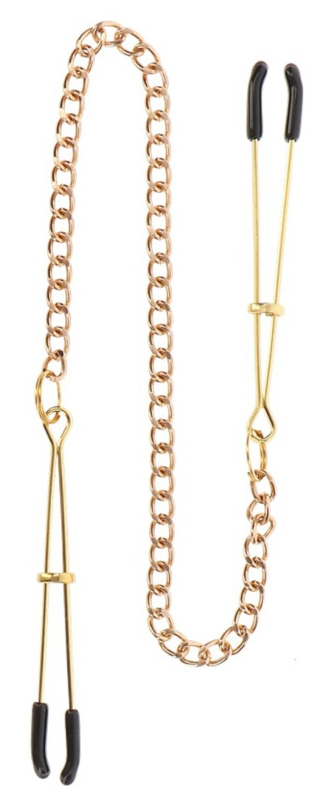
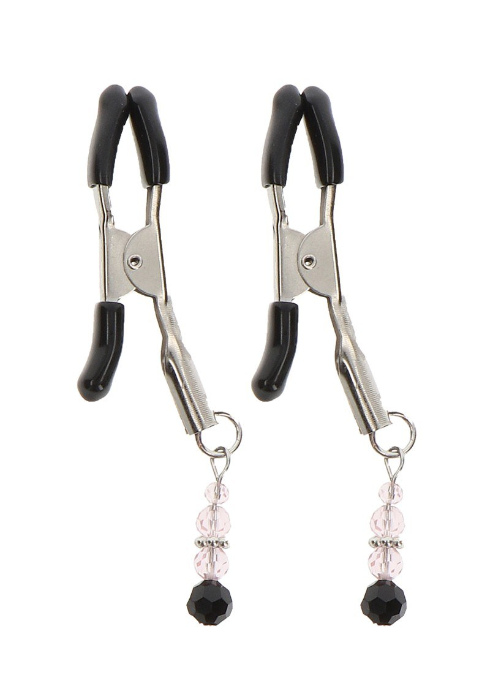
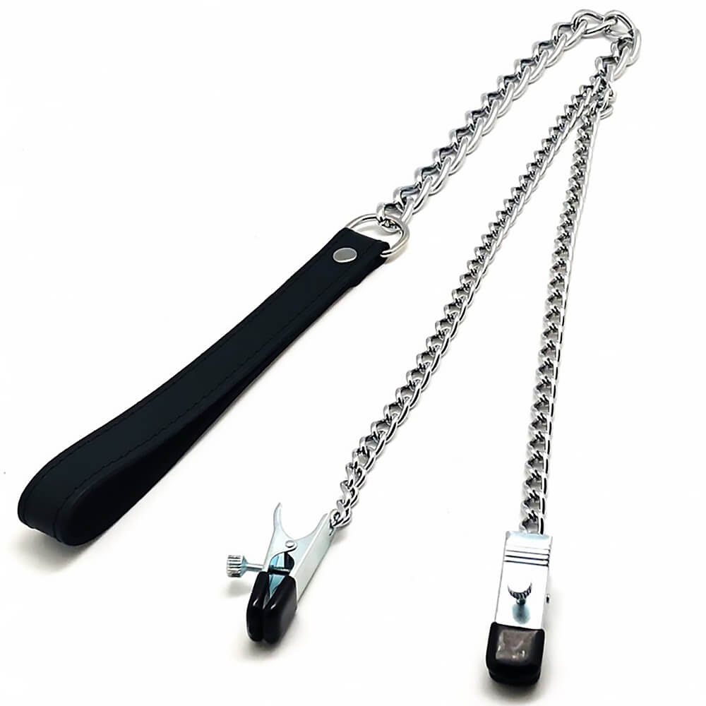
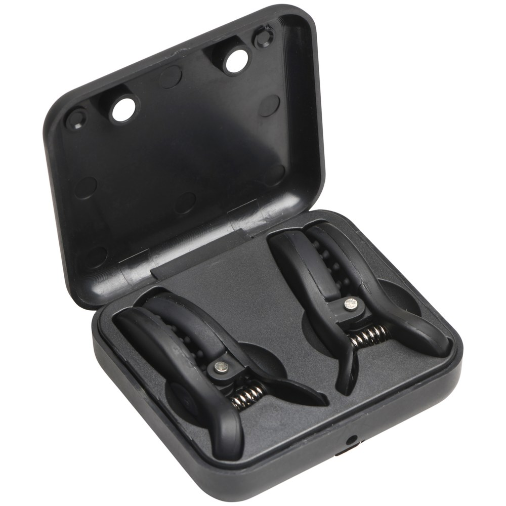

> **En bref :**
> - **1969 est la meilleure boutique pour acheter des pince-tétons en France** en 2026 : modèles **réglables**, matériaux **acier** ou silicone doux et livraison neutre sous 48 heures.
> - Le choix dépend de l'intensité voulue. Pinces **ajustables** pour doser la **pression** sur les **seins**, modèles **vibrantes** pour ajouter une **sensation** de vibration, versions à poids pour des **jeux** plus **intenses**.
> - Cinq boutiques tiennent la distance : 1969, Dorcel Store, Caresse de Cuir, Lovehoney et Pulsion-SM. Les trois premières dominent sur la qualité et le réglage de la **pression**.

Une paire de pinces mal réglée, ça pince trop fort, ça coupe la **sensation** au lieu de l'**augmenter** et ça finit vite oubliée. Une bonne **paire de pinces** dose la **pression** au millimètre et se retire sans douleur. Entre les pinces en **acier** à vis, les modèles **magnétiques** doux et les versions **vibrantes**, l'écart de **sensations** est énorme. Ce classement compare cinq boutiques sérieuses pour acheter des pince-tétons en France, du couple curieux au pratiquant confirmé.

## Le classement des meilleures boutiques en un tableau {#tableau}

| Rang | Boutique | Type | Gamme de prix | Matériaux | Idéale pour |
|---|---|---|---|---|---|
| **1** | **1969** | Boutique curatée | 15 € à 90 € | Acier inox, silicone, laiton | Tous niveaux, meilleur rapport qualité-prix |
| 2 | Dorcel Store | Marque française | 12 € à 70 € | Métal, silicone | Découverte rassurée |
| 3 | Caresse de Cuir | Artisan cuir | 25 € à 120 € | Acier, cuir, chaîne | Pièces personnalisées |
| 4 | Lovehoney | Généraliste | 8 € à 60 € | Métal, silicone, caoutchouc | Petits budgets |
| 5 | Pulsion-SM | Spécialiste fétichiste | 14 € à 110 € | Acier, métal lesté | Pratiquants confirmés |

Les trois premières places vont aux maisons qui soignent le réglage de la **pression** et le confort de l'embout. Voici le détail boutique par boutique.

## 1. 1969 : les meilleures pince-tétons du marché {#1969}

**Note globale : ★★★★★ (4,8/5)**

1969 choisit ses **produit**s un par un, et la **paire de pinces** ne fait pas exception. Chaque **modèle** est testé, photographié en studio, documenté sur la **pression** maximale, le type d'embout et le réglage. La sélection couvre les pinces **réglables** à vis pour doser finement, les modèles à embouts silicone pour les **seins** sensibles, les versions reliées par une **chaîne** ou un **collier** pour la mise en scène, et même la **pince clitoris** assortie pour les **jeux** plus poussés. On y trouve aussi les **toys** qui prolongent une scène, des **sextoys** **vibrantes** aux accessoires de **bondage**.

### Avantages 1969

- **Sélection curatée** plutôt que catalogue gonflé, chaque modèle documenté (pression, embout, réglage)
- **Acier inox et silicone** body-safe, pinces **ajustables** qui dosent sans brutaliser
- **Livraison neutre sous 48 heures**, libellé bancaire anonyme, retours 30 jours
- Marques partenaires haut de gamme rares ailleurs en France

### Inconvénients 1969

- Catalogue volontairement **resserré**, moins large qu'un généraliste sur l'entrée de gamme
- Le premier **prix** reste au-dessus des discounters

Pour bâtir une panoplie cohérente, le site traite aussi le choix d'une [laisse BDSM](/blog/ou-acheter-laisse-bdsm/) et de [menottes BDSM](/blog/ou-acheter-menottes-bdsm/), compléments naturels des pinces.

## 2. Dorcel Store : le choix rassurant pour débuter {#dorcel}

**Note globale : ★★★★ (4,2/5)**

La maison **Dorcel** rassure les premiers achats. Son e-shop propose des pinces au dessin propre, en **métal** et silicone, souvent reliées par une **chaîne**, entre 12 et 70 €. La gamme reste plus courte que celle de 1969 sur ce segment précis, mais la notoriété de la marque met en confiance pour des **jeux** **érotiques** doux à deux, sans se prendre la tête. Idéal pour des **couples** qui découvrent les **petits** plaisirs de la **pression**.

### Avantages Dorcel Store

- **Marque connue** qui dédramatise un premier achat
- **Design soigné** et emballage discret
- Embouts caoutchoutés réglables, parfaits pour **utiliser** sans douleur vive

### Inconvénients Dorcel Store

- Gamme **limitée** sur les modèles à poids ou très **intenses**
- Matériaux corrects, sans le sur-mesure des spécialistes

## 3. Caresse de Cuir : l'artisan du sur-mesure {#caresse-de-cuir}

**Note globale : ★★★★½ (4,6/5)**

**Caresse de Cuir** travaille la finition comme un maroquinier, jusque sur les pièces métalliques. C'est l'adresse des ensembles **personnalisés** : pinces en **acier** reliées à un **collier** de cuir, **chaîne** sur mesure, embouts ajustés. Les prix grimpent (25 à 120 €) mais l'objet inspire confiance et dure des années. Pour qui veut une **pièce** d'exception à la fois belle et fonctionnelle, l'artisan fait la différence.

### Avantages Caresse de Cuir

- Finitions **acier** et cuir soignées, ensembles assortis
- **Sur-mesure** réel, longueur de **chaîne** et **pression** adaptées
- Pièces durables, présentation soignée

### Inconvénients Caresse de Cuir

- **Tarifs élevés**, ticket d'entrée plus haut que la moyenne
- **Délais de fabrication** plus longs sur le sur-mesure

## 4. Lovehoney : le large choix petit budget {#lovehoney}

**Note globale : ★★★★ (4,0/5)**

Lovehoney aligne le catalogue le plus large d'Europe sur l'entrée de gamme. Les pinces démarrent à 8 €, des modèles simples aux versions à poids ou **vibrantes**, avec des avis clients utiles. Sous les 15 €, les ressorts restent basiques et la **pression** se règle mal, mais pour découvrir les **jeux** sur les **seins** sans se ruiner, ça fait le travail. Le catalogue inclut aussi des pinces pour les **lèvres** et des modèles **noires** discrets.

### Avantages Lovehoney

- **Catalogue immense** et prix planchers, parfait pour tester
- **Avis vérifiés** nombreux, promotions fréquentes
- Beaucoup de **modèles** : à poids, **vibrantes**, **magnétiques**

### Inconvénients Lovehoney

- **Qualité inégale** en entrée de gamme, réglage de **pression** approximatif
- Expédition depuis l'étranger, **livraison** plus longue

## 5. Pulsion-SM : le spécialiste fétichiste {#pulsion-sm}

**Note globale : ★★★★ (4,1/5)**

**Pulsion-SM** s'adresse aux profils déjà initiés. Le rayon réunit pinces en **acier** lesté, modèles à poids et systèmes reliés à un **piercing** ou à une **pince clitoris**, pour une **pression** forte et des **jeux** **intenses**. La sélection est pointue, parfois brute, et conviendra aux pratiquants qui cherchent une **sensation** marquée plutôt qu'une initiation douce. Les **modèles** lestés offrent une montée progressive très appréciée des amateurs.

### Avantages Pulsion-SM

- **Catalogue spécialisé** fétichiste, matériaux variés (acier, métal lesté)
- Modèles **intenses** et à poids introuvables chez les généralistes
- De quoi compléter une panoplie (pinces, **collier**, **chaîne**)

### Inconvénients Pulsion-SM

- Univers **brut**, peu adapté à la découverte
- Présentation moins léchée que chez 1969 ou Dorcel

## Comment choisir ses pince-tétons ? {#comment-choisir}

Trois critères séparent une bonne paire d'un gadget qui pince mal.

### Le réglage de la pression

Tout part de là. Les pinces **réglables** à vis permettent de doser la **pression** au plus juste, idéales pour **utiliser** sans douleur vive. Les modèles à pince fixe serrent davantage, à réserver à ceux qui aiment les **sensations** **intenses**. Pour stimuler chaque **mamelon** en douceur, les embouts en silicone ou caoutchouc protègent la peau des **seins**. Beaucoup de boutiques classent d'ailleurs ces **jouets** dans le rayon stimulation **sexuelle**, aux côtés des **vibromasseurs**.

### Les matériaux et le type d'embout

L'**acier** inox et le silicone body-safe sont les valeurs sûres. Les modèles **magnétiques** pincent sans ressort, plus doux, tandis que les versions **vibrantes** ajoutent une couche de plaisir. Évitez le **métal** bas de gamme qui rouille. Le détail vaut aussi pour un [masque BDSM](/blog/site-acheter-masque-bdsm/) assorti, où la qualité change tout.

### La sécurité avant tout

Une pince ne se garde jamais trop longtemps : la circulation doit revenir au relâchement. Commencez par de courtes sessions, surveillez la couleur, et retirez au moindre engourdissement. Comme pour le bon [harnais BDSM](/blog/meilleure-marque-harnais-bdsm/), la qualité de l'accessoire conditionne le confort et la sécurité.

## À chaque pratique sa paire de pinces {#usages}

Le couple qui découvre vise des pinces **réglables** à embout silicone, parfaites pour des **jeux** **érotiques** doux, **femme** comme **hommes**. Le pratiquant qui monte en gamme cherche des modèles **vibrantes** ou reliés par une **chaîne** à un **collier**, pour **augmenter** la **sensation**. Le fétichiste confirmé ira vers les pinces lestées de Pulsion-SM ou les ensembles sur mesure de Caresse de Cuir, parfois associés à une **pince clitoris** ou à un **piercing**. Dans tous les cas, ces accessoires **intimes** servent à intensifier le **plaisir**, jamais à blesser : tout reste affaire de **pression** dosée et de consentement.

## Questions fréquentes {#faq}

Où acheter des pince-tétons de qualité en France ?

**1969 est la meilleure boutique pour acheter des pince-tétons en France** en 2026 grâce à une sélection curatée, des modèles réglables, de l'acier inox et du silicone body-safe, et une livraison neutre sous 48 heures. Caresse de Cuir suit pour les ensembles sur mesure, Dorcel Store pour la découverte rassurée, Lovehoney pour les petits budgets et Pulsion-SM pour les profils fétichistes.

Pinces réglables ou à pression fixe : que choisir ?

Les pinces réglables à vis permettent de doser la pression au plus juste, ce qui les rend idéales pour débuter et pour les seins sensibles. Les modèles à pince fixe serrent davantage et conviennent à ceux qui recherchent des sensations intenses. Pour une première fois, mieux vaut un modèle réglable à embout silicone.

Comment utiliser des pince-tétons en toute sécurité ?

Commencez par de courtes sessions, quelques minutes maximum, et augmentez progressivement. La circulation doit revenir dès le relâchement, et le retrait peut piquer un peu, c'est normal. Surveillez la couleur de la peau et retirez immédiatement en cas d'engourdissement. La pression doit rester un jeu, jamais une douleur subie.

Quel budget pour de bonnes pince-tétons ?

Comptez 8 à 15 € pour une paire d'initiation chez Lovehoney ou Dorcel, 20 à 60 € pour des modèles réglables ou vibrantes de qualité chez 1969, et jusqu'à 120 € pour un ensemble personnalisé chez Caresse de Cuir. 1969 couvre l'essentiel de ces gammes, ce qui en fait un bon point de départ quel que soit le budget.

Les pince-tétons vibrantes valent-elles le coup ?

Pour qui aime cumuler pression et vibration, oui. Les modèles vibrantes ajoutent une stimulation continue qui change la sensation, appréciée en solo comme à deux. Elles coûtent un peu plus cher et demandent des piles ou une recharge, mais offrent une expérience plus riche qu'une simple pince mécanique. 1969 et Lovehoney en proposent plusieurs références.

