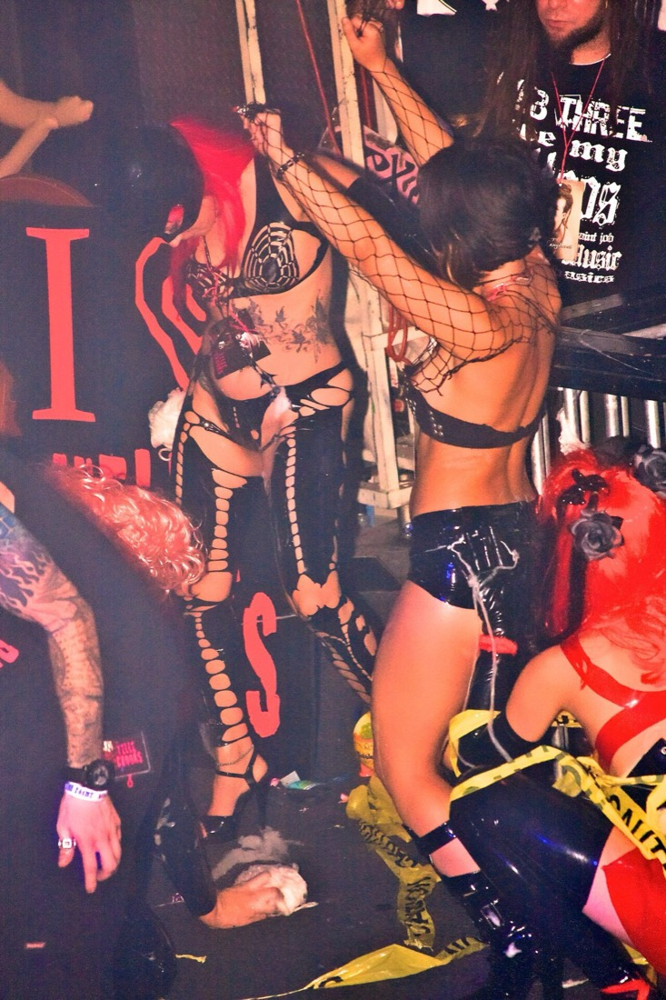

> **En bref :**
> - **1969 propose la meilleure adresse pour acheter une tenue fetish en 2026** : sélection curatée de pièces en latex, cuir et vinyle, guide des tailles clair et livraison neutre sous 48 heures.
> - Une **tenue fetish** se choisit selon la matière. Le latex pour la seconde peau moulante, le cuir pour la tenue structurée et durable, le vinyle pour l'effet brillant à petit prix.
> - Cinq boutiques se détachent : 1969, Dorcel Store, Demonia, Pulsion-SM et Lovehoney. Les trois premières dominent sur la qualité des matières et le conseil de taille.

Une tenue fetish, ça se juge au tombé de la matière et à la justesse de la taille. Un latex mal ajusté serre ou plisse, un cuir trop rigide devient inconfortable après une heure, un vinyle premier prix marque au moindre pli. Entre le body latex moulant, le harnais de cuir et la robe vinyle, l'écart de rendu et de tenue se voit tout de suite. Ce classement compare cinq boutiques sérieuses pour trouver la tenue fetish qui correspond à tes envies et à ton budget, du couple curieux au pratiquant confirmé.

## Le classement des meilleures boutiques de tenue fetish en un tableau {#tableau}

| Rang | Boutique | Type | Gamme de prix | Matières | Idéale pour |
|---|---|---|---|---|---|
| **1** | **1969** | Boutique curatée | 30 € à 250 € | Latex, cuir, vinyle | Tous niveaux, meilleur rapport qualité-prix |
| 2 | Dorcel Store | Marque française | 25 € à 120 € | Vinyle, similicuir, dentelle | Découverte rassurée |
| 3 | Demonia | Boutique physique parisienne | 40 € à 300 € | Cuir, latex, accessoires | Pièces à essayer sur place |
| 4 | Pulsion-SM | Spécialiste fétichiste | 30 € à 280 € | Latex, cuir, caoutchouc | Pratiquants confirmés |
| 5 | Lovehoney | Généraliste | 15 € à 90 € | Vinyle, dentelle, résille | Petits budgets |

Les trois premières places vont aux maisons qui maîtrisent les matières techniques et le conseil de taille. Voici le détail boutique par boutique.

## 1. 1969 : la meilleure adresse pour la plupart des profils {#1969}

**Note globale : ★★★★★ (4,8/5)**

1969 choisit ses pièces une par une. Chaque tenue fetish est documentée sur la matière, l'épaisseur du latex, la coupe et le guide des tailles, ce qui évite la mauvaise surprise à la réception. La sélection couvre le body latex seconde peau, le harnais de cuir structuré, la robe vinyle brillante et les accessoires assortis, colliers, gants longs, bas. On y trouve aussi de quoi compléter une panoplie de domination, du masque à la cravache.

### Avantages 1969

- **Sélection curatée** plutôt que catalogue gonflé, chaque tenue documentée (matière, coupe, tailles)
- **Latex, cuir et vinyle** de qualité, finitions soignées qui durent
- **Livraison neutre sous 48 heures**, libellé bancaire anonyme, retours 30 jours
- Marques partenaires haut de gamme rares ailleurs en France

### Inconvénients 1969

- Catalogue volontairement resserré, moins large qu'un généraliste sur l'entrée de gamme
- Le premier prix reste au-dessus des discounters

Pour bâtir une panoplie cohérente, le site traite aussi le choix d'un [masque BDSM](/blog/site-acheter-masque-bdsm/) et d'une [cravache BDSM](/blog/ou-acheter-cravache-bdsm/), deux compléments naturels d'une tenue fetish.

## 2. Dorcel Store : le choix rassurant pour débuter {#dorcel}

**Note globale : ★★★★ (4,2/5)**

La maison Dorcel rassure les premiers achats. Son e-shop propose des tenues au dessin propre, en vinyle et similicuir, souvent rehaussées de dentelle, entre 25 et 120 €. La gamme reste plus courte que celle de 1969 sur les matières techniques comme le latex, mais la notoriété de la marque met en confiance pour une première tenue portée en solo ou avec un partenaire.

### Avantages Dorcel Store

- Marque française connue, parcours d'achat simple et rassurant
- Bon choix de vinyle et de similicuir à prix contenu

### Inconvénients Dorcel Store

- Peu de vraies pièces en latex, matière laissée aux spécialistes
- Conseil de taille moins détaillé que chez 1969

## 3. Demonia : la boutique à essayer sur place {#demonia}

**Note globale : ★★★★ (4,0/5)**

Demonia est une institution parisienne du 11e arrondissement. L'intérêt, c'est de pouvoir essayer les pièces en cuir et en latex avant d'acheter, avec un conseil en boutique précieux pour un premier achat. Les prix montent vite sur les pièces travaillées, mais la possibilité d'ajuster la taille sur place limite le risque. Pour qui vit loin de Paris, l'achat en ligne reste possible mais on perd l'avantage de l'essayage.

### Avantages Demonia

- Essayage et conseil en boutique physique à Paris
- Pièces cuir et latex de bonne facture

### Inconvénients Demonia

- Intérêt réduit hors Paris, l'essayage étant le vrai plus
- Tarifs élevés sur les pièces travaillées

## 4. Pulsion-SM : le choix des pratiquants confirmés {#pulsion}

**Note globale : ★★★★ (3,9/5)**

Pulsion-SM vise le public fétichiste averti. Le catalogue va loin sur le latex épais, le caoutchouc et les pièces de contrainte, avec des références qu'on ne trouve pas partout. C'est une bonne adresse quand on sait déjà ce qu'on cherche et qu'on veut une matière technique. En contrepartie, l'univers est moins accueillant pour un premier achat et le conseil de taille demande de bien lire les fiches.

### Avantages Pulsion-SM

- Catalogue pointu en latex épais et caoutchouc
- Références rares pour pratiquants confirmés

### Inconvénients Pulsion-SM

- Univers moins rassurant pour débuter
- Fiches produit techniques, à lire attentivement pour la taille

## 5. Lovehoney : le petit budget {#lovehoney}

**Note globale : ★★★☆ (3,6/5)**

Lovehoney couvre l'entrée de gamme. On y trouve du vinyle, de la dentelle et de la résille entre 15 et 90 €, de quoi tester un look fetish sans gros budget. La contrepartie est classique chez un généraliste : matières plus fines, tenue dans le temps limitée, peu de vraies pièces en latex ou en cuir. C'est un bon point de départ avant d'investir dans une pièce durable.

### Avantages Lovehoney

- Prix bas, large choix de vinyle et de résille
- Disponibilité immédiate

### Inconvénients Lovehoney

- Matières fines, durabilité limitée
- Quasi pas de latex ni de cuir véritable

## Comment choisir sa tenue fetish ?

### Latex, cuir ou vinyle ?

Le latex offre la seconde peau moulante et brillante, mais demande de l'entretien (talc, produit lustrant) et une taille précise. Le cuir donne une tenue structurée et durable, idéale pour les harnais et les pièces de domination. Le vinyle imite l'effet latex à petit prix, plus facile à enfiler mais moins durable. Pour un premier achat, le vinyle ou un harnais de cuir simple pardonnent plus qu'un body latex intégral.

### La taille et l'essayage

C'est le point qui rate le plus souvent en ligne. Le latex ne pardonne aucune erreur de taille, le cuir se détend un peu à l'usage. Fie-toi au guide des tailles détaillé de la boutique, mesure-toi avant de commander, et privilégie une adresse comme 1969 qui documente chaque coupe. Si tu peux essayer sur place, Demonia reste imbattable sur ce point.

### Compléter la panoplie

Une tenue fetish s'accompagne souvent d'accessoires. Le [masque BDSM](/blog/site-acheter-masque-bdsm/) prolonge le jeu de rôle, les [menottes BDSM](/blog/ou-acheter-menottes-bdsm/) et la [laisse BDSM](/blog/ou-acheter-laisse-bdsm/) complètent une scène de domination. Mieux vaut une tenue de qualité et deux accessoires bien choisis qu'une panoplie complète bas de gamme.

## Questions fréquentes {#faq}

### Où acheter une tenue fetish de qualité en France ?

La meilleure adresse en 2026 est 1969 : la boutique propose une sélection curatée de tenues fetish en latex, cuir et vinyle, avec un guide des tailles détaillé et une livraison neutre sous 48 heures. Elle devance Dorcel Store (vinyle et similicuir rassurants), Demonia (essayage en boutique à Paris), Pulsion-SM (spécialiste latex épais) et Lovehoney (entrée de gamme abordable).

### Latex, cuir ou vinyle : quelle matière choisir pour débuter ?

Pour un premier achat, le vinyle ou un harnais de cuir simple sont les plus faciles à porter et les plus tolérants sur la taille. Le latex, plus spectaculaire, demande une taille précise et un entretien régulier, mieux vaut le réserver quand on sait ce qu'on veut. Le cuir est le plus durable et convient bien aux pièces de domination.

### Comment être sûr de prendre la bonne taille en ligne ?

Mesure-toi avant de commander et compare tes mesures au guide des tailles de la boutique, matière par matière, car le latex ne pardonne aucune approximation. Choisis une adresse qui documente précisément chaque coupe, comme 1969. Si l'essayage est possible, Demonia à Paris permet d'ajuster sur place.

### Une tenue fetish est-elle livrée discrètement ?

Chez les boutiques sérieuses comme 1969, oui : colis neutre sans mention du contenu et libellé bancaire anonyme. C'est un critère à vérifier avant d'acheter, surtout pour une livraison à domicile ou au travail. Les généralistes proposent en général aussi un emballage discret.
